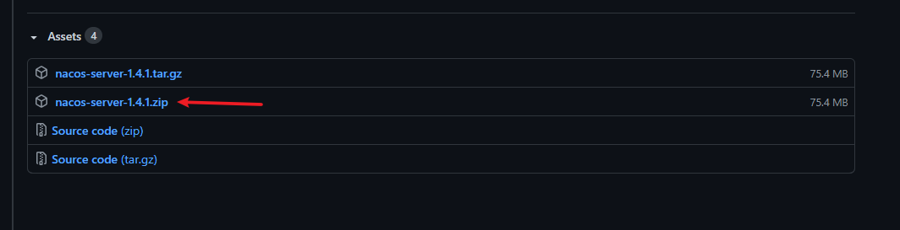
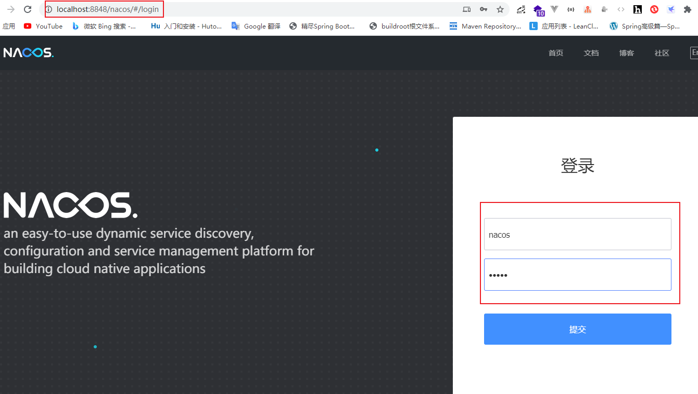
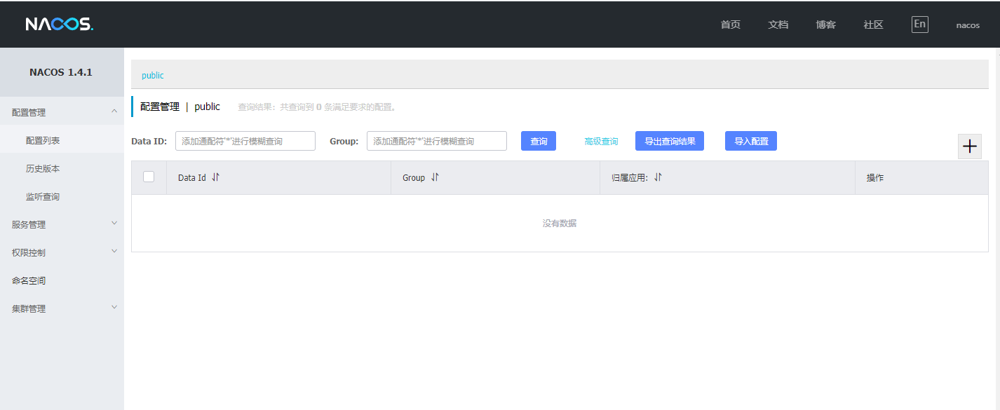
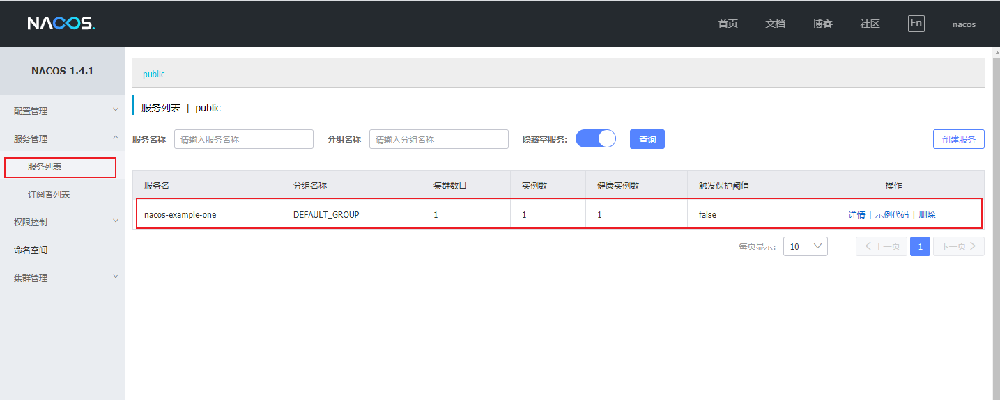
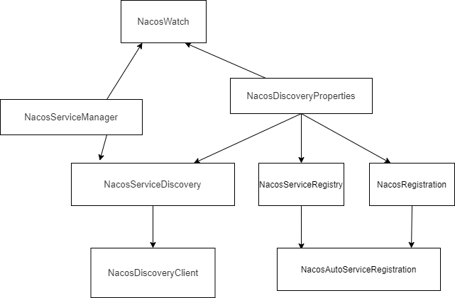

# 下载与运行

https://github.com/alibaba/nacos/releases



如果下载慢，可复制下面链接到迅雷等下载器下载

https://github.com.cnpmjs.org/alibaba/nacos/releases/download/1.4.1/nacos-server-1.4.1.zip

进入bin目录执行命令，以单机模式启动nacos

```shell
ddd@DESKTOP-OKBQRKQ MINGW64 /d/nacos-server-1.4.1/nacos/bin
$ ./startup.cmd -m standalone
"nacos is starting with standalone"

         ,--.
       ,--.'|
   ,--,:  : |                                           Nacos 1.4.1
,`--.'`|  ' :                       ,---.               Running in stand alone mode, All function modules
|   :  :  | |                      '   ,'\   .--.--.    Port: 8848
:   |   \ | :  ,--.--.     ,---.  /   /   | /  /    '   Pid: 13260
|   : '  '; | /       \   /     \.   ; ,. :|  :  /`./   Console: http://192.168.56.1:8848/nacos/index.html
'   ' ;.    ;.--.  .-. | /    / ''   | |: :|  :  ;_
|   | | \   | \__\/: . ..    ' / '   | .; : \  \    `.      https://nacos.io
'   : |  ; .' ," .--.; |'   ; :__|   :    |  `----.   \
|   | '`--'  /  /  ,.  |'   | '.'|\   \  /  /  /`--'  /
'   : |     ;  :   .'   \   :    : `----'  '--'.     /
;   |.'     |  ,     .-./\   \  /            `--'---'
'---'        `--`---'     `----'

```

浏览器输入 http://localhost:8848/nacos/ 访问nacos

账号和密码默认是 nacos






# 注册一个服务进nacos

[完整代码示例](https://github.com/xxnjdg/learning-spring-cloud-alibaba/tree/master/learning-spring-cloud-alibaba-nacos/nacos-example-one)

添加依赖

```xml
<dependencies>
    <dependency>
        <groupId>com.alibaba.cloud</groupId>
        <artifactId>spring-cloud-starter-alibaba-nacos-discovery</artifactId>
    </dependency>

    <dependency>
        <groupId>org.springframework.boot</groupId>
        <artifactId>spring-boot-starter-web</artifactId>
    </dependency>
</dependencies>
```

修改 application.yml

```yaml
server:
  port: 27991
spring:
  # 服务名
  application:
    name: nacos-example-one
  # 注册中心nacos地址
  cloud:
    nacos:
      discovery:
        server-addr: 192.168.100.14:8848
```

启动服务后，打开控制台，看到自己注册的服务名，表示成功注册



# 客户端配置属性
<table>
    <tr>
        <td>配置项</td> 
        <td>key</td>
        <td>默认值</td> 
        <td>说明</td> 
   </tr>
    <tr bgcolor="#adff2f">
	    <td>服务端地址</td>
	    <td>spring.cloud.nacos.discovery.server-addr</td>
	    <td>localhost:8848</td>
	    <td>Nacos Server 启动监听的ip地址和端口,可以写多个地址，用逗号分割</td>
    </tr>
    <tr>
    	<td>用户名</td>
    	<td>spring.cloud.nacos.discovery.username</td>
    	<td></td>
    	<td>要打开才生效</td>
    </tr>
    <tr>
    	<td>密码</td>
    	<td>spring.cloud.nacos.discovery.password</td>
    	<td></td>
    	<td>要打开才生效</td>
    </tr>
    <tr>
    	<td>接入点</td>
    	<td>spring.cloud.nacos.discovery.endpoint</td>
    	<td></td>
    	<td>地域的某个服务的入口域名，通过此域名可以动态地拿到服务端地址</td>
    </tr>
    <tr bgcolor="#adff2f">
    	<td>命名空间</td>
    	<td>spring.cloud.nacos.discovery.namespace</td>
    	<td></td>
    	<td>常用场景之一是不同环境的注册的区分隔离，例如开发测试环境和生产环境的资源（如配置、服务）隔离等，clinet端不填，服务端默认给public</td>
    </tr>
    <tr>
    	<td>nacos watch</td>
    	<td>spring.cloud.nacos.discovery.watch-delay</td>
    	<td>30000ms</td>
    	<td>todo</td>
    </tr>
    <tr>
    	<td>是否开启Nacos Watch</td>
    	<td>spring.cloud.nacos.discovery.watch.enabled</td>
    	<td>true</td>
    	<td>可以设置成false来关闭 watch</td>
    </tr>
    <tr>
    	<td>日志文件名</td>
    	<td>spring.cloud.nacos.discovery.log-name</td>
    	<td></td>
    	<td></td>
    </tr>
    <tr bgcolor="#adff2f">
    	<td>服务名</td>
    	<td>spring.cloud.nacos.discovery.service</td>
    	<td>${spring.application.name}</td>
    	<td>注册的服务名</td>
    </tr>
    <tr>
    	<td>权重</td>
    	<td>spring.cloud.nacos.discovery.weight</td>
    	<td>1.0</td>
    	<td>取值范围 1 到 100，数值越大，权重越大</td>
    </tr>
    <tr>
    	<td>集群</td>
    	<td>spring.cloud.nacos.discovery.cluster-name</td>
    	<td>DEFAULT</td>
    	<td>Nacos集群名称</td>
    </tr>
    <tr bgcolor="#adff2f">
    	<td>组</td>
    	<td>spring.cloud.nacos.discovery.group</td>
    	<td>DEFAULT_GROUP</td>
    	<td>Nacos组名称</td>
    </tr>
    <tr>
    	<td>服务发现列表缓存预加载</td>
    	<td>spring.cloud.nacos.discovery.naming-load-cache-at-start</td>
    	<td>false</td>
    	<td>为true时会先从缓存文件读取服务列表，客户端向服务端请求到的服务列表会写入到缓存文件，等请求到服务列表和当前的列表不同时会重新写入到缓存文件中</td>
    </tr>
    <tr>
    	<td>元数据</td>
    	<td>spring.cloud.nacos.discovery.metadata</td>
    	<td>{preserved.register.source=<br/>SPRING_CLOUD}</td>
    	<td>使用Map格式配置，用户可以根据自己的需要自定义一些和服务相关的元数据信息</td>
    </tr>
    <tr>
    	<td>是否启动注册</td>
    	<td>spring.cloud.nacos.discovery.register-enabled</td>
    	<td>true</td>
    	<td>为true服务启动时会自动注册进注册中心</td>
    </tr>
    <tr>
    	<td>注册客户端的IP地址</td>
    	<td>spring.cloud.nacos.discovery.ip</td>
    	<td>分情况</td>
    	<td>优先级最高，如果没有配置此项，此时网卡名配了，看网卡名说明，否则用<br/>inetUtils.findFirstNonLoopbackHostInfo()<br/>.getIpAddress()生成</td>
    </tr>
    <tr>
    	<td>网卡名</td>
    	<td>spring.cloud.nacos.discovery.network-interface</td>
    	<td></td>
    	<td>当IP未配置时，注册的IP为此网卡所对应的IP地址，如果此项也未配置，则默认取第一块网卡的地址</td>
    </tr>
    <tr>
    	<td>注册的客户端端口</td>
    	<td>spring.cloud.nacos.discovery.port</td>
    	<td>${server.port}</td>
    	<td>默认情况下不用配置，会自动探测</td>
    </tr>
    <tr>
    	<td>todo</td>
    	<td>spring.cloud.nacos.discovery.secure</td>
    	<td>false</td>
    	<td></td>
    </tr>
    <tr>
    	<td>AccessKey</td>
    	<td>spring.cloud.nacos.discovery.access-key</td>
    	<td></td>
    	<td>当要上阿里云时，阿里云上面的一个云账号名</td>
    </tr>
    <tr>
    	<td>SecretKey</td>
    	<td>spring.cloud.nacos.discovery.secret-key</td>
    	<td></td>
    	<td>当要上阿里云时，阿里云上面的一个云账号密码</td>
    </tr>
    <tr>
    	<td>客户端心跳间隔</td>
    	<td>spring.cloud.nacos.discovery.heart-beat-interval</td>
    	<td></td>
    	<td>如果不填，服务端会指定默认为5s,客户端5s发送心跳</td>
    </tr>
    <tr>
    	<td>客户端心跳超时时间</td>
    	<td>spring.cloud.nacos.discovery.heart-beat-timeout</td>
    	<td></td>
    	<td>如果不填，服务端会指定默认为15s,超过15s没有发送心跳，服务端修改客户端状态为不健康，但不会剔除客户端</td>
    </tr>
    <tr>
    	<td>客户端ip删除时间</td>
    	<td>spring.cloud.nacos.discovery.ip-delete-timeout</td>
    	<td></td>
    	<td>如果不填，服务端会指定默认为30s,超过30s没有发送心跳，服务自动剔除客户端</td>
    </tr>
    <tr>
    	<td>实例是否启动</td>
    	<td>spring.cloud.nacos.discovery.instance-enabled</td>
    	<td>true</td>
    	<td>实例是否启动</td>
    </tr>
    <tr>
    	<td>是否是非持久化实例</td>
    	<td>spring.cloud.nacos.discovery.ephemeral</td>
    	<td>true</td>
    	<td>true为非持久化实例，非持久化实例会定期上传心跳，告诉服务端他是健康的</td>
    </tr>
</table>

# 服务端配置

```properties
#*************** Spring Boot Related Configurations ***************#
### Default web context path:
server.servlet.contextPath=/nacos
### Default web server port:
server.port=8848

#*************** Network Related Configurations ***************#
### If prefer hostname over ip for Nacos server addresses in cluster.conf:
# nacos.inetutils.prefer-hostname-over-ip=false

### Specify local server's IP:
# nacos.inetutils.ip-address=


#*************** Config Module Related Configurations ***************#
### If use MySQL as datasource:
# spring.datasource.platform=mysql

### Count of DB:
# db.num=1

### Connect URL of DB:
# db.url.0=jdbc:mysql://127.0.0.1:3306/nacos?characterEncoding=utf8&connectTimeout=1000&socketTimeout=3000&autoReconnect=true&useUnicode=true&useSSL=false&serverTimezone=UTC
# db.user.0=nacos
# db.password.0=nacos

### Connection pool configuration: hikariCP
db.pool.config.connectionTimeout=30000
db.pool.config.validationTimeout=10000
db.pool.config.maximumPoolSize=20
db.pool.config.minimumIdle=2

#*************** Naming Module Related Configurations ***************#
### Data dispatch task execution period in milliseconds:
### 同步实例信息到其他Server时间间隔
# nacos.naming.distro.taskDispatchPeriod=200

### Data count of batch sync task:
# nacos.naming.distro.batchSyncKeyCount=1000

### Retry delay in milliseconds if sync task failed:
### 同步实例信息到其他Server任务失败后，任务重试间隔
# nacos.naming.distro.syncRetryDelay=5000

### If enable data warmup. If set to false, the server would accept request without local data preparation:
# nacos.naming.data.warmup=true

### If enable the instance auto expiration, kind like of health check of instance:
### 为true超过实例删除超时时间会自动剔除实例，false只是会设置实例不健康，不会剔除实例
# nacos.naming.expireInstance=true

nacos.naming.empty-service.auto-clean=true
nacos.naming.empty-service.clean.initial-delay-ms=50000
nacos.naming.empty-service.clean.period-time-ms=30000


#*************** CMDB Module Related Configurations ***************#
### The interval to dump external CMDB in seconds:
# nacos.cmdb.dumpTaskInterval=3600

### The interval of polling data change event in seconds:
# nacos.cmdb.eventTaskInterval=10

### The interval of loading labels in seconds:
# nacos.cmdb.labelTaskInterval=300

### If turn on data loading task:
# nacos.cmdb.loadDataAtStart=false


#*************** Metrics Related Configurations ***************#
### Metrics for prometheus
#management.endpoints.web.exposure.include=*

### Metrics for elastic search
management.metrics.export.elastic.enabled=false
#management.metrics.export.elastic.host=http://localhost:9200

### Metrics for influx
management.metrics.export.influx.enabled=false
#management.metrics.export.influx.db=springboot
#management.metrics.export.influx.uri=http://localhost:8086
#management.metrics.export.influx.auto-create-db=true
#management.metrics.export.influx.consistency=one
#management.metrics.export.influx.compressed=true


#*************** Access Log Related Configurations ***************#
### If turn on the access log:
server.tomcat.accesslog.enabled=true

### The access log pattern:
server.tomcat.accesslog.pattern=%h %l %u %t "%r" %s %b %D %{User-Agent}i %{Request-Source}i

### The directory of access log:
server.tomcat.basedir=


#*************** Access Control Related Configurations ***************#
### If enable spring security, this option is deprecated in 1.2.0:
#spring.security.enabled=false

### The ignore urls of auth, is deprecated in 1.2.0:
nacos.security.ignore.urls=/,/error,/**/*.css,/**/*.js,/**/*.html,/**/*.map,/**/*.svg,/**/*.png,/**/*.ico,/console-ui/public/**,/v1/auth/**,/v1/console/health/**,/actuator/**,/v1/console/server/**

### The auth system to use, currently only 'nacos' is supported:
nacos.core.auth.system.type=nacos

### If turn on auth system:
### 开启安全功能
nacos.core.auth.enabled=false

### The token expiration in seconds:
### token 过期时间
nacos.core.auth.default.token.expire.seconds=18000

### The default token:
nacos.core.auth.default.token.secret.key=SecretKey012345678901234567890123456789012345678901234567890123456789

### Turn on/off caching of auth information. By turning on this switch, the update of auth information would have a 15 seconds delay.
nacos.core.auth.caching.enabled=true

### Since 1.4.1, Turn on/off white auth for user-agent: nacos-server, only for upgrade from old version.
### 这是bug，要设置为false
nacos.core.auth.enable.userAgentAuthWhite=true

### Since 1.4.1, worked when nacos.core.auth.enabled=true and nacos.core.auth.enable.userAgentAuthWhite=false.
### The two properties is the white list for auth and used by identity the request from other server.
### nacos.core.auth.enabled 为true时要设置
nacos.core.auth.server.identity.key=
nacos.core.auth.server.identity.value=

#*************** Istio Related Configurations ***************#
### If turn on the MCP server:
nacos.istio.mcp.server.enabled=false


###*************** Add from 1.3.0 ***************###


#*************** Core Related Configurations ***************#

### set the WorkerID manually
# nacos.core.snowflake.worker-id=

### Member-MetaData
# nacos.core.member.meta.site=
# nacos.core.member.meta.adweight=
# nacos.core.member.meta.weight=

### MemberLookup
### Addressing pattern category, If set, the priority is highest
# nacos.core.member.lookup.type=[file,address-server]
## Set the cluster list with a configuration file or command-line argument
# nacos.member.list=192.168.16.101:8847?raft_port=8807,192.168.16.101?raft_port=8808,192.168.16.101:8849?raft_port=8809
## for AddressServerMemberLookup
# Maximum number of retries to query the address server upon initialization
# nacos.core.address-server.retry=5
## Server domain name address of [address-server] mode
# address.server.domain=jmenv.tbsite.net
## Server port of [address-server] mode
# address.server.port=8080
## Request address of [address-server] mode
# address.server.url=/nacos/serverlist

#*************** JRaft Related Configurations ***************#

### Sets the Raft cluster election timeout, default value is 5 second
# nacos.core.protocol.raft.data.election_timeout_ms=5000
### Sets the amount of time the Raft snapshot will execute periodically, default is 30 minute
# nacos.core.protocol.raft.data.snapshot_interval_secs=30
### raft internal worker threads
# nacos.core.protocol.raft.data.core_thread_num=8
### Number of threads required for raft business request processing
# nacos.core.protocol.raft.data.cli_service_thread_num=4
### raft linear read strategy. Safe linear reads are used by default, that is, the Leader tenure is confirmed by heartbeat
# nacos.core.protocol.raft.data.read_index_type=ReadOnlySafe
### rpc request timeout, default 5 seconds
# nacos.core.protocol.raft.data.rpc_request_timeout_ms=5000

```


# spring-cloud-starter-alibaba-nacos-discovery

```text
com.alibaba.cloud.nacos.discovery.reactive.NacosReactiveDiscoveryClientConfiguration,\
com.alibaba.cloud.nacos.endpoint.NacosDiscoveryEndpointAutoConfiguration,\
com.alibaba.cloud.nacos.discovery.configclient.NacosConfigServerAutoConfiguration,\
com.alibaba.cloud.nacos.NacosServiceAutoConfiguration
com.alibaba.cloud.nacos.discovery.NacosDiscoveryAutoConfiguration,\
com.alibaba.cloud.nacos.registry.NacosServiceRegistryAutoConfiguration,\
com.alibaba.cloud.nacos.discovery.NacosDiscoveryClientConfiguration,\
com.alibaba.cloud.nacos.ribbon.RibbonNacosAutoConfiguration,\
```

重点关注这个 NacosAutoServiceRegistration 类

NacosAutoServiceRegistration 继承 AbstractAutoServiceRegistration，这个类实现 ApplicationListener<WebServerInitializedEvent>
在spring容器初始化时会发送 WebServerInitializedEvent 信号，那么以下的 onApplicationEvent 就会执行

```java
public class NacosAutoServiceRegistration
        extends AbstractAutoServiceRegistration<Registration> {
    
}

public abstract class AbstractAutoServiceRegistration<R extends Registration> 
        implements AutoServiceRegistration, ApplicationContextAware, ApplicationListener<WebServerInitializedEvent> {
    public void onApplicationEvent(WebServerInitializedEvent event) {
        this.bind(event);
    }

    @Deprecated
    public void bind(WebServerInitializedEvent event) {
        ApplicationContext context = event.getApplicationContext();
        if (!(context instanceof ConfigurableWebServerApplicationContext) || !"management".equals(((ConfigurableWebServerApplicationContext)context).getServerNamespace())) {
            this.port.compareAndSet(0, event.getWebServer().getPort());
            this.start();
        }
    }

    public void start() {
        if (!this.isEnabled()) {
            if (logger.isDebugEnabled()) {
                logger.debug("Discovery Lifecycle disabled. Not starting");
            }

        } else {
            if (!this.running.get()) {
                this.context.publishEvent(new InstancePreRegisteredEvent(this, this.getRegistration()));
                this.register();
                if (this.shouldRegisterManagement()) {
                    this.registerManagement();
                }

                this.context.publishEvent(new InstanceRegisteredEvent(this, this.getConfiguration()));
                this.running.compareAndSet(false, true);
            }

        }
    }

    protected void register() {
        this.serviceRegistry.register(this.getRegistration());
    }
}
```

```java
public class NacosServiceRegistry implements ServiceRegistry<Registration> {

    // 注册实例进 nacos
    @Override
    public void register(Registration registration) {

        if (StringUtils.isEmpty(registration.getServiceId())) {
            log.warn("No service to register for nacos client...");
            return;
        }

        //获取 NamingService
        NamingService namingService = namingService();
        String serviceId = registration.getServiceId();
        String group = nacosDiscoveryProperties.getGroup();

        Instance instance = getNacosInstanceFromRegistration(registration);

        try {
            //这个方法注册进 nacos
            namingService.registerInstance(serviceId, group, instance);
            log.info("nacos registry, {} {} {}:{} register finished", group, serviceId,
                    instance.getIp(), instance.getPort());
        } catch (Exception e) {
            log.error("nacos registry, {} register failed...{},", serviceId,
                    registration.toString(), e);
            // rethrow a RuntimeException if the registration is failed.
            // issue : https://github.com/alibaba/spring-cloud-alibaba/issues/1132
            rethrowRuntimeException(e);
        }
    }

    private NamingService namingService() {
        return nacosServiceManager
                .getNamingService(nacosDiscoveryProperties.getNacosProperties());
    }
}

public class NacosServiceManager {
    private NamingService namingService;
    
    //获取 NamingService，如果没有就创建
    public NamingService getNamingService(Properties properties) {
        if (Objects.isNull(this.namingService)) {
            buildNamingService(properties);
        }
        return namingService;
    }
    //双重检测
    private NamingService buildNamingService(Properties properties) {
        if (Objects.isNull(namingService)) {
            synchronized (NacosServiceManager.class) {
                if (Objects.isNull(namingService)) {
                    namingService = createNewNamingService(properties);
                }
            }
        }
        return namingService;
    }
    
    private NamingService createNewNamingService(Properties properties) {
        try {
            //创建 createNamingService
            return createNamingService(properties);
        }
        catch (NacosException e) {
            throw new RuntimeException(e);
        }
    }
}
```

