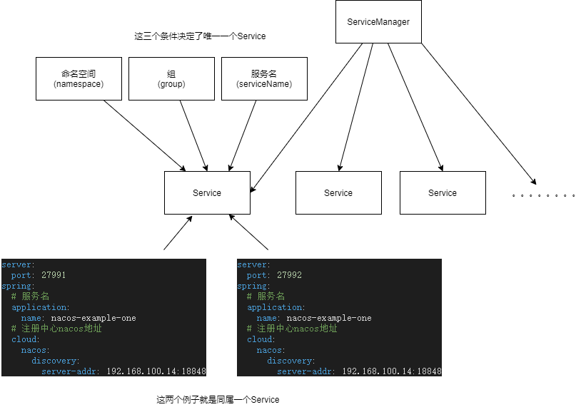
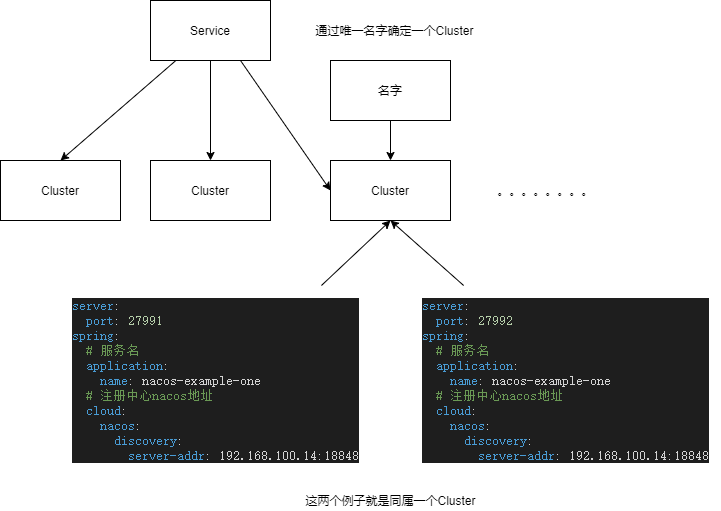
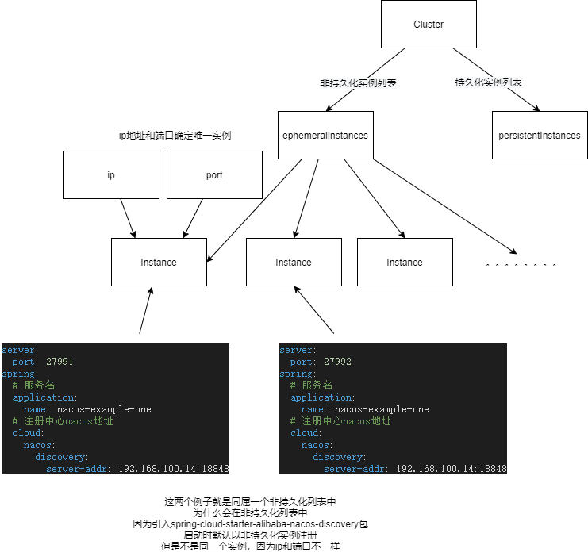
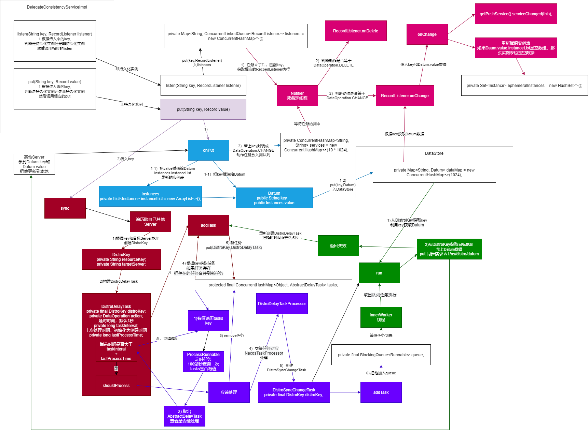

nacos 版本 1.4.1

# 客户端非持久化注册，AP模式

引入下面包，启动时会自动注册，默认非持久化注册，使用AP方式 

```xml
<dependencies>
    <dependency>
        <groupId>com.alibaba.cloud</groupId>
        <artifactId>spring-cloud-starter-alibaba-nacos-discovery</artifactId>
    </dependency>

    <dependency>
        <groupId>org.springframework.boot</groupId>
        <artifactId>spring-boot-starter-web</artifactId>
    </dependency>
</dependencies>
```

## NacosNamingService

调用 com.alibaba.nacos.api.NacosFactory#createNamingService(java.util.Properties) 创建 NacosNamingService

```java
public class NacosNamingService implements NamingService {

    /**
     * Each Naming service should have different namespace.
     * 如果 nacosDiscoveryProperties.getNamespace() 没有修改，使用默认public
     */
    private String namespace;

    //Properties 的 endpoint 属性获取
    //地域的某个服务的入口域名，通过此域名可以动态地拿到服务端地址
    //endpoint 和 serverList二选一，不能同时存在，都配了，endpoint 优先级高
    private String endpoint;

    //Properties 的 serverAddr 属性获取
    //Nacos Server 启动监听的ip地址和端口,可以写多个地址，用逗号分割
    //endpoint 和 serverList二选一，不能同时存在，都配了，endpoint 优先级高
    private String serverList;

    //缓存文件夹
    private String cacheDir;

    //log名字
    private String logName;

    private HostReactor hostReactor;

    //和发送心跳相关
    private BeatReactor beatReactor;

    private NamingProxy serverProxy;
}
```

### NamingProxy

```java
public class NamingProxy implements Closeable {

    //http通信工具
    private final NacosRestTemplate nacosRestTemplate = NamingHttpClientManager.getInstance().getNacosRestTemplate();

    private static final int DEFAULT_SERVER_PORT = 8848;

    private int serverPort = DEFAULT_SERVER_PORT;

    //namespace 名称
    private final String namespaceId;

    //同 NacosNamingService.endpoint
    private final String endpoint;

    //如果 serverList 长度等于1，即单机模式
    // nacosDomain就等于serverList
    private String nacosDomain;

    //NacosNamingService.serverList.split(",") 分割后数组
    private List<String> serverList;

    //从 endpoint 获取的服务列表
    private List<String> serversFromEndpoint = new ArrayList<String>();

    //和获取token有关
    private final SecurityProxy securityProxy;

    private long lastSrvRefTime = 0L;

    private final long vipSrvRefInterMillis = TimeUnit.SECONDS.toMillis(30);

    private final long securityInfoRefreshIntervalMills = TimeUnit.SECONDS.toMillis(5);

    //Properties
    private Properties properties;

    //定时任务线城池
    private ScheduledExecutorService executorService;

    //单机模式最大重试，默认3
    private int maxRetry;
}
```

#### 定时任务

线程名字 com.alibaba.nacos.client.naming.updater

每30秒循环执行一次，<font color=#008000>refreshSrvIfNeed()</font> ,解析 endpoint 地址，动态请求获取服务地址，配了 serverList 无视这个任务

每5秒循环执行一次，<font color=#008000>securityProxy.login(getServerList())</font>  请求 /nacos/v1/auth/users/login 获取 accessToken，
如果没有配置 spring.cloud.nacos.discovery.username 和 spring.cloud.nacos.discovery.password 不会去请求 

### HostReactor

这个类和服务发现有关，在服务发现讲解

### registerInstance

创建 NacosNamingService 后会调用 public void registerInstance(String serviceName, String groupName, Instance instance) throws NacosException 注册一个实例

```java
public class NacosNamingService implements NamingService {
    @Override
    public void registerInstance(String serviceName, String groupName, Instance instance) throws NacosException {
        NamingUtils.checkInstanceIsLegal(instance);
        //groupName + Constants.SERVICE_INFO_SPLITER + serviceName
        String groupedServiceName = NamingUtils.getGroupedName(serviceName, groupName);
        if (instance.isEphemeral()) {
            //构造 beatInfo
            BeatInfo beatInfo = beatReactor.buildBeatInfo(groupedServiceName, instance);
            //2) 启动一个线程隔5秒发送心跳
            beatReactor.addBeatInfo(groupedServiceName, beatInfo);
        }
        //1) post 请求 /nacos/v1/ns/instance 注册
        serverProxy.registerService(groupedServiceName, groupName, instance);
    }
}
```

#### 注册

请求 /nacos/v1/ns/instance 会带上参数，整理了下，基本上就是根据 nacosDiscoveryProperties 构造以下参数

```text
params.put(CommonParams.NAMESPACE_ID, nacosDiscoveryProperties.getNamespace()/public);
params.put(CommonParams.SERVICE_NAME, nacosDiscoveryProperties.getGroup() + @@ + nacosDiscoveryProperties.getService());
params.put(CommonParams.GROUP_NAME, nacosDiscoveryProperties.getGroup());
params.put(CommonParams.CLUSTER_NAME, nacosDiscoveryProperties.getClusterName());
params.put("ip", nacosDiscoveryProperties.getIp());
params.put("port", String.valueOf(nacosDiscoveryProperties.getPort()));
params.put("weight", String.valueOf(nacosDiscoveryProperties.getWeight()));
params.put("enable", String.valueOf(nacosDiscoveryProperties.isInstanceEnabled()));
params.put("healthy", String.valueOf(instance.isHealthy() = true));
params.put("ephemeral", String.valueOf(nacosDiscoveryProperties.isEphemeral()));
params.put("metadata", JacksonUtils.toJson(nacosDiscoveryProperties.getMetadata()));

如果token存在
params.put(Constants.ACCESS_TOKEN, securityProxy.getAccessToken());

如果 ak/sk存在
String signData = getSignData(params.get("serviceName"));
String signature = SignUtil.sign(signData, sk);
params.put("signature", signature);
params.put("data", signData);
params.put("ak", ak);
```

#### 定时任务-发送心跳

可以先跳去看服务端注册，因为发送心跳会延时5s执行，网络正常的情况下，先注册在发送心跳

```text
BeatInfo beatInfo = new BeatInfo();
beatInfo.setServiceName(nacosDiscoveryProperties.getGroup() + @@ + nacosDiscoveryProperties.getService());
beatInfo.setIp(nacosDiscoveryProperties.getIp());
beatInfo.setPort(nacosDiscoveryProperties.getPort());
beatInfo.setCluster(nacosDiscoveryProperties.getClusterName());
beatInfo.setWeight(nacosDiscoveryProperties.getWeight());
beatInfo.setMetadata(nacosDiscoveryProperties.getMetadata());
beatInfo.setScheduled(false);
beatInfo.setPeriod(instance.getInstanceHeartBeatInterval());//默认5秒
```

```java
public class BeatReactor implements Closeable {
    public void addBeatInfo(String serviceName, BeatInfo beatInfo) {
        NAMING_LOGGER.info("[BEAT] adding beat: {} to beat map.", beatInfo);
        String key = buildKey(serviceName, beatInfo.getIp(), beatInfo.getPort());
        BeatInfo existBeat = null;
        //fix #1733
        if ((existBeat = dom2Beat.remove(key)) != null) {
            existBeat.setStopped(true);
        }
        dom2Beat.put(key, beatInfo);
        //默认5秒循环执行一次
        executorService.schedule(new BeatTask(beatInfo), beatInfo.getPeriod(), TimeUnit.MILLISECONDS);
        MetricsMonitor.getDom2BeatSizeMonitor().set(dom2Beat.size());
    }
}
```

```java
class BeatTask implements Runnable {
        @Override
        public void run() {
            if (beatInfo.isStopped()) {
                return;
            }
            //5000
            long nextTime = beatInfo.getPeriod();
            try {
                //发送心跳
                // put 请求 /nacos/v1/ns/instance/beat，文章后面详细讲服务端心跳处理
                JsonNode result = serverProxy.sendBeat(beatInfo, BeatReactor.this.lightBeatEnabled);
                long interval = result.get("clientBeatInterval").asLong();
                boolean lightBeatEnabled = false;
                if (result.has(CommonParams.LIGHT_BEAT_ENABLED)) {
                    //发完心跳后设置为true
                    lightBeatEnabled = result.get(CommonParams.LIGHT_BEAT_ENABLED).asBoolean();
                }
                BeatReactor.this.lightBeatEnabled = lightBeatEnabled;
                if (interval > 0) {
                    nextTime = interval;
                }
                int code = NamingResponseCode.OK;
                if (result.has(CommonParams.CODE)) {
                    code = result.get(CommonParams.CODE).asInt();
                }
                if (code == NamingResponseCode.RESOURCE_NOT_FOUND) {
                    //之前是发过心跳，但是心跳到了删除超时时间没发心跳，导致自动删除了
                    Instance instance = new Instance();
                    instance.setPort(beatInfo.getPort());
                    instance.setIp(beatInfo.getIp());
                    instance.setWeight(beatInfo.getWeight());
                    instance.setMetadata(beatInfo.getMetadata());
                    instance.setClusterName(beatInfo.getCluster());
                    instance.setServiceName(beatInfo.getServiceName());
                    instance.setInstanceId(instance.getInstanceId());
                    instance.setEphemeral(true);
                    try {
                        //重新注册
                        serverProxy.registerService(beatInfo.getServiceName(),
                                NamingUtils.getGroupName(beatInfo.getServiceName()), instance);
                    } catch (Exception ignore) {
                    }
                }
            } catch (NacosException ex) {
                NAMING_LOGGER.error("[CLIENT-BEAT] failed to send beat: {}, code: {}, msg: {}",
                        JacksonUtils.toJson(beatInfo), ex.getErrCode(), ex.getErrMsg());

            }
            //重新调度
            executorService.schedule(new BeatTask(beatInfo), nextTime, TimeUnit.MILLISECONDS);
        }
    }
```

put 请求 /nacos/v1/ns/instance/beat，请求参数

```text
params.put(CommonParams.NAMESPACE_ID, nacosDiscoveryProperties.getNamespace()/public);
params.put(CommonParams.SERVICE_NAME, nacosDiscoveryProperties.getGroup() + @@ + nacosDiscoveryProperties.getService());
params.put(CommonParams.CLUSTER_NAME, nacosDiscoveryProperties.getClusterName());
params.put("ip", nacosDiscoveryProperties.getIp());
params.put("port", String.valueOf(nacosDiscoveryProperties.getPort()));
bodyMap.put("beat", JacksonUtils.toJson(beatInfo));
如果token存在
params.put(Constants.ACCESS_TOKEN, securityProxy.getAccessToken());

如果 ak/sk存在
String signData = getSignData(params.get("serviceName"));
String signature = SignUtil.sign(signData, sk);
params.put("signature", signature);
params.put("data", signData);
params.put("ak", ak);
```

# Service-Cluster-Instance 模型简单介绍

```java
@Component
public class ServiceManager implements RecordListener<Service> {

    /**
     * Map(namespace, Map(group::serviceName, Service)).
     * 管理多个 Service
     */
    private final Map<String, Map<String, Service>> serviceMap = new ConcurrentHashMap<>();
}
```



```java
@JsonInclude(Include.NON_NULL)
public class Service extends com.alibaba.nacos.api.naming.pojo.Service implements Record, RecordListener<Instances> {
    private Map<String, Cluster> clusterMap = new HashMap<>();
}
```



```java
public class Cluster extends com.alibaba.nacos.api.naming.pojo.Cluster implements Cloneable {

    @JsonIgnore
    private Set<Instance> persistentInstances = new HashSet<>();

    @JsonIgnore
    private Set<Instance> ephemeralInstances = new HashSet<>();
}
```



# consistencyService 简单介绍



# 服务端注册

com.alibaba.nacos.naming.controllers.InstanceController#register 方法接受请求

1 根据传入的参数构造 com.alibaba.nacos.naming.core.Instance

```java
@RestController
@RequestMapping(UtilsAndCommons.NACOS_NAMING_CONTEXT + "/instance")
public class InstanceController {
    @CanDistro
    @PostMapping
    @Secured(parser = NamingResourceParser.class, action = ActionTypes.WRITE)
    public String register(HttpServletRequest request) throws Exception {

        final String namespaceId = WebUtils
                .optional(request, CommonParams.NAMESPACE_ID, Constants.DEFAULT_NAMESPACE_ID);
        final String serviceName = WebUtils.required(request, CommonParams.SERVICE_NAME);
        NamingUtils.checkServiceNameFormat(serviceName);

        //根据接受到的参数构造 Instance
        final Instance instance = parseInstance(request);

        serviceManager.registerInstance(namespaceId, serviceName, instance);
        return "ok";
    }
}
```

instance 的值整理了下

```text
instance.setPort(nacosDiscoveryProperties.getIp());
instance.setIp(nacosDiscoveryProperties.getIp());
instance.setEphemeral(String.valueOf(nacosDiscoveryProperties.isEphemeral()));
instance.setClusterName(nacosDiscoveryProperties.getClusterName());
instance.setWeight(Double.parseDouble(String.valueOf(nacosDiscoveryProperties.getWeight())));
instance.setHealthy(String.valueOf(instance.isHealthy() = true));
instance.setEnabled(String.valueOf(nacosDiscoveryProperties.isInstanceEnabled()));
instance.setApp("DEFAULT");
instance.setServiceName(groupName + @@ + serviceName);
instance.setInstanceId(getIp() + "#" + getPort() + "#" + getClusterName() + "#" + getServiceName(););
instance.setLastBeat(System.currentTimeMillis());
instance.setMetadata(UtilsAndCommons.parseMetadata(JacksonUtils.toJson(nacosDiscoveryProperties.getMetadata())));
```


```java
@Component
public class ServiceManager implements RecordListener<Service> {
    public void registerInstance(String namespaceId, String serviceName, Instance instance) throws NacosException {

        //获取 Service，如果不存在创建服务
        createEmptyService(namespaceId, serviceName, instance.isEphemeral());

        //获取 Service
        Service service = getService(namespaceId, serviceName);

        if (service == null) {
            throw new NacosException(NacosException.INVALID_PARAM,
                    "service not found, namespace: " + namespaceId + ", service: " + serviceName);
        }

        //加入实例
        addInstance(namespaceId, serviceName, instance.isEphemeral(), instance);
    }
}
```

2 获取 Service， namespace 和 group::serviceName 确定唯一 Service，如果没有则创建 Service，consistencyService 监听 Service，一旦 consistencyService 数据更新了，告诉 Service 更新

```java
@Component
public class ServiceManager implements RecordListener<Service> {

    public void createServiceIfAbsent(String namespaceId, String serviceName, boolean local, Cluster cluster)
            throws NacosException {
        Service service = getService(namespaceId, serviceName);
        //如果没有 service 创建
        if (service == null) {

            Loggers.SRV_LOG.info("creating empty service {}:{}", namespaceId, serviceName);
            service = new Service();
            //设置属性
            service.setName(serviceName);
            service.setNamespaceId(namespaceId);
            service.setGroupName(NamingUtils.getGroupName(serviceName));
            // now validate the service. if failed, exception will be thrown
            // 现在验证服务。 如果失败，将引发异常
            service.setLastModifiedMillis(System.currentTimeMillis());
            service.recalculateChecksum();
            if (cluster != null) {
                cluster.setService(service);
                service.getClusterMap().put(cluster.getName(), cluster);
            }
            service.validate();

            //重点方法
            putServiceAndInit(service);
            if (!local) {
                addOrReplaceService(service);
            }
        }
    }

    private void putServiceAndInit(Service service) throws NacosException {
        //放入 serviceMap
        putService(service);
        //初始化,后面定时任务讲解
        service.init();
        //consistencyService 监听 Service，一旦 consistencyService 数据更新了，告诉 Service 更新
        //非持久化实例关注这个
        consistencyService
                .listen(KeyBuilder.buildInstanceListKey(service.getNamespaceId(), service.getName(), true), service);
        //非持久化实例不关心这个
        consistencyService
                .listen(KeyBuilder.buildInstanceListKey(service.getNamespaceId(), service.getName(), false), service);
        Loggers.SRV_LOG.info("[NEW-SERVICE] {}", service.toJson());
    }
}
```

3 service 下所有旧实例更新一些属性后和新实例合并一起，这里的旧实例，看ephemeral参数，true是非持久化实例，false是持久化实例，这里是非持久化实例， 把合并后实例列表更新进 consistencyService

addIpAddresses方法，会获取Cluster，名字不同确定唯一 Cluster ，如果没有创建 com.alibaba.nacos.naming.core.Cluster

```java
@Component
public class ServiceManager implements RecordListener<Service> {
    public void addInstance(String namespaceId, String serviceName, boolean ephemeral, Instance... ips)
            throws NacosException {

        //构造一个key,这个key 用于 consistencyService
        String key = KeyBuilder.buildInstanceListKey(namespaceId, serviceName, ephemeral);

        //获取 Service
        Service service = getService(namespaceId, serviceName);

        synchronized (service) {
            //service 下所有旧实例更新一些属性后和新实例合并一起，
            //这里的旧实例，看ephemeral参数，true是非持久化实例，false是持久化实例
            //这里是非持久化实例
            List<Instance> instanceList = addIpAddresses(service, ephemeral, ips);

            Instances instances = new Instances();
            instances.setInstanceList(instanceList);

            // 把合并后实例列表更新进 consistencyService 
            consistencyService.put(key, instances);
        }
    }

    private List<Instance> addIpAddresses(Service service, boolean ephemeral, Instance... ips) throws NacosException {
        return updateIpAddresses(service, UtilsAndCommons.UPDATE_INSTANCE_ACTION_ADD, ephemeral, ips);
    }

    public List<Instance> updateIpAddresses(Service service, String action, boolean ephemeral, Instance... ips)
            throws NacosException {

        //获取 Datum,存实例列表
        Datum datum = consistencyService
                .get(KeyBuilder.buildInstanceListKey(service.getNamespaceId(), service.getName(), ephemeral));

        //获取所有的非持久化实例
        List<Instance> currentIPs = service.allIPs(ephemeral);
        Map<String, Instance> currentInstances = new HashMap<>(currentIPs.size());
        Set<String> currentInstanceIds = Sets.newHashSet();

        for (Instance instance : currentIPs) {
            currentInstances.put(instance.toIpAddr(), instance);
            currentInstanceIds.add(instance.getInstanceId());
        }

        Map<String, Instance> instanceMap;
        if (datum != null && null != datum.value) {
            //Cluster 比 Datum 新？
            //是的，Service 定时任务会修改 Cluster 下非持久化 Instance.healthy 属性，后面定时任务详细讲
            //客户端发送心跳，服务端处理心跳会修改 Cluster 下非持久化 Instance.healthy 和 Instance.lastBeat 属性
            instanceMap = setValid(((Instances) datum.value).getInstanceList(), currentInstances);
        } else {
            //这种情况就是没有注册过，要不就是实例没有心跳，自动剔除实例，最后一个都不剩
            instanceMap = new HashMap<>(ips.length);
        }

        for (Instance instance : ips) {
            //如果 instance.getClusterName() 对应的 Cluster 没有创建
            if (!service.getClusterMap().containsKey(instance.getClusterName())) {
                Cluster cluster = new Cluster(instance.getClusterName(), service);
                cluster.init();
                service.getClusterMap().put(instance.getClusterName(), cluster);
                Loggers.SRV_LOG
                        .warn("cluster: {} not found, ip: {}, will create new cluster with default configuration.",
                                instance.getClusterName(), instance.toJson());
            }

            if (UtilsAndCommons.UPDATE_INSTANCE_ACTION_REMOVE.equals(action)) {
                //移除实例
                instanceMap.remove(instance.getDatumKey());
            } else {
                //ADD action
                Instance oldInstance = instanceMap.get(instance.getDatumKey());
                //重新设置 instanceId
                if (oldInstance != null) {
                    instance.setInstanceId(oldInstance.getInstanceId());
                } else {
                    instance.setInstanceId(instance.generateInstanceId(currentInstanceIds));
                }
                instanceMap.put(instance.getDatumKey(), instance);
            }

        }

        if (instanceMap.size() <= 0 && UtilsAndCommons.UPDATE_INSTANCE_ACTION_ADD.equals(action)) {
            throw new IllegalArgumentException(
                    "ip list can not be empty, service: " + service.getName() + ", ip list: " + JacksonUtils
                            .toJson(instanceMap.values()));
        }

        return new ArrayList<>(instanceMap.values());
    }
}
```

4 实际就是DataStore存入合并后实例，回调监听的 Service

```java
@DependsOn("ProtocolManager")
@org.springframework.stereotype.Service("distroConsistencyService")
public class DistroConsistencyServiceImpl implements EphemeralConsistencyService, DistroDataProcessor {
    @Override
    public void put(String key, Record value) throws NacosException {
        //将注册实例更新到内存注册表中
        onPut(key, value);
        //复制新数据到服务集群中
        distroProtocol.sync(new DistroKey(key, KeyBuilder.INSTANCE_LIST_KEY_PREFIX), DataOperation.CHANGE,
                globalConfig.getTaskDispatchPeriod() / 2);
    }

    public void onPut(String key, Record value) {

        if (KeyBuilder.matchEphemeralInstanceListKey(key)) {
            Datum<Instances> datum = new Datum<>();
            datum.value = (Instances) value;
            datum.key = key;
            datum.timestamp.incrementAndGet();
            //存入内存注册表
            dataStore.put(key, datum);
        }

        if (!listeners.containsKey(key)) {
            return;
        }

        //回调监听的 Service，注意key值要相同
        notifier.addTask(key, DataOperation.CHANGE);
    }
}
```

5 Service被告知数据更新了，把新合并后实例更新到 Cluster 相应实例集合

从这里开始会出现以下方法，这个方法和服务发现有关，在服务发现讲解，暂时跳过

```text
getPushService().serviceChanged(this);
getPushService().serviceChanged(service);
```

```java
@JsonInclude(Include.NON_NULL)
public class Service extends com.alibaba.nacos.api.naming.pojo.Service implements Record, RecordListener<Instances> {
    //当 Instances 更新了就会调用这个方法
    @Override
    public void onChange(String key, Instances value) throws Exception {

        Loggers.SRV_LOG.info("[NACOS-RAFT] datum is changed, key: {}, value: {}", key, value);

        for (Instance instance : value.getInstanceList()) {

            if (instance == null) {
                // Reject this abnormal instance list:
                throw new RuntimeException("got null instance " + key);
            }

            if (instance.getWeight() > 10000.0D) {
                instance.setWeight(10000.0D);
            }

            if (instance.getWeight() < 0.01D && instance.getWeight() > 0.0D) {
                instance.setWeight(0.01D);
            }
        }

        //重点方法
        updateIPs(value.getInstanceList(), KeyBuilder.matchEphemeralInstanceListKey(key));

        recalculateChecksum();
    }

    public void updateIPs(Collection<Instance> instances, boolean ephemeral) {
        Map<String, List<Instance>> ipMap = new HashMap<>(clusterMap.size());
        for (String clusterName : clusterMap.keySet()) {
            ipMap.put(clusterName, new ArrayList<>());
        }

        for (Instance instance : instances) {
            try {
                if (instance == null) {
                    Loggers.SRV_LOG.error("[NACOS-DOM] received malformed ip: null");
                    continue;
                }

                if (StringUtils.isEmpty(instance.getClusterName())) {
                    instance.setClusterName(UtilsAndCommons.DEFAULT_CLUSTER_NAME);
                }

                //如果对应的 Cluster 不存在
                if (!clusterMap.containsKey(instance.getClusterName())) {
                    Loggers.SRV_LOG
                            .warn("cluster: {} not found, ip: {}, will create new cluster with default configuration.",
                                    instance.getClusterName(), instance.toJson());
                    //创建 Cluster
                    Cluster cluster = new Cluster(instance.getClusterName(), this);
                    //初始化，定时任务讲解
                    cluster.init();
                    getClusterMap().put(instance.getClusterName(), cluster);
                }

                //Cluster 不存在时，重新创建集合
                List<Instance> clusterIPs = ipMap.get(instance.getClusterName());
                if (clusterIPs == null) {
                    clusterIPs = new LinkedList<>();
                    ipMap.put(instance.getClusterName(), clusterIPs);
                }

                //把实例放入 clusterIPs
                clusterIPs.add(instance);
            } catch (Exception e) {
                Loggers.SRV_LOG.error("[NACOS-DOM] failed to process ip: " + instance, e);
            }
        }

        for (Map.Entry<String, List<Instance>> entry : ipMap.entrySet()) {
            //make every ip mine
            List<Instance> entryIPs = entry.getValue();
            //新合并后实例更新到 Cluster 相应实例集合
            clusterMap.get(entry.getKey()).updateIps(entryIPs, ephemeral);
        }

        setLastModifiedMillis(System.currentTimeMillis());
        getPushService().serviceChanged(this);
        StringBuilder stringBuilder = new StringBuilder();

        for (Instance instance : allIPs()) {
            stringBuilder.append(instance.toIpAddr()).append("_").append(instance.isHealthy()).append(",");
        }

        Loggers.EVT_LOG.info("[IP-UPDATED] namespace: {}, service: {}, ips: {}", getNamespaceId(), getName(),
                stringBuilder.toString());

    }
}
```

6 更新 ephemeralInstances

```java
public class Cluster extends com.alibaba.nacos.api.naming.pojo.Cluster implements Cloneable {
    public void updateIps(List<Instance> ips, boolean ephemeral) {

        Set<Instance> toUpdateInstances = ephemeral ? ephemeralInstances : persistentInstances;

        HashMap<String, Instance> oldIpMap = new HashMap<>(toUpdateInstances.size());

        //从 toUpdateInstances 获取旧数据
        for (Instance ip : toUpdateInstances) {
            oldIpMap.put(ip.getDatumKey(), ip);
        }

        //ips 和 老集合对比找出需要更新的实例集合
        List<Instance> updatedIPs = updatedIps(ips, oldIpMap.values());
        if (updatedIPs.size() > 0) {
            for (Instance ip : updatedIPs) {
                Instance oldIP = oldIpMap.get(ip.getDatumKey());

                // do not update the ip validation status of updated ips
                // because the checker has the most precise result
                // Only when ip is not marked, don't we update the health status of IP:
                if (!ip.isMarked()) {
                    ip.setHealthy(oldIP.isHealthy());
                }

                if (ip.isHealthy() != oldIP.isHealthy()) {
                    // ip validation status updated
                    Loggers.EVT_LOG.info("{} {SYNC} IP-{} {}:{}@{}", getService().getName(),
                            (ip.isHealthy() ? "ENABLED" : "DISABLED"), ip.getIp(), ip.getPort(), getName());
                }

                if (ip.getWeight() != oldIP.getWeight()) {
                    // ip validation status updated
                    Loggers.EVT_LOG.info("{} {SYNC} {IP-UPDATED} {}->{}", getService().getName(), oldIP.toString(),
                            ip.toString());
                }
            }
        }

        //新加入的实例
        List<Instance> newIPs = subtract(ips, oldIpMap.values());
        if (newIPs.size() > 0) {
            Loggers.EVT_LOG
                    .info("{} {SYNC} {IP-NEW} cluster: {}, new ips size: {}, content: {}", getService().getName(),
                            getName(), newIPs.size(), newIPs.toString());

            for (Instance ip : newIPs) {
                //初始化 HealthCheckStatus
                HealthCheckStatus.reset(ip);
            }
        }

        List<Instance> deadIPs = subtract(oldIpMap.values(), ips);

        if (deadIPs.size() > 0) {
            Loggers.EVT_LOG
                    .info("{} {SYNC} {IP-DEAD} cluster: {}, dead ips size: {}, content: {}", getService().getName(),
                            getName(), deadIPs.size(), deadIPs.toString());

            for (Instance ip : deadIPs) {
                HealthCheckStatus.remv(ip);
            }
        }

        toUpdateInstances = new HashSet<>(ips);

        if (ephemeral) {
            //更新 toUpdateInstances
            ephemeralInstances = toUpdateInstances;
        } else {
            persistentInstances = toUpdateInstances;
        }
    }
}
```

## 定时任务

在前面服务注册的时候创建了定时任务

```java
@JsonInclude(Include.NON_NULL)
public class Service extends com.alibaba.nacos.api.naming.pojo.Service implements Record, RecordListener<Instances> {
    public void init() {
        //起一个调度任务
        HealthCheckReactor.scheduleCheck(clientBeatCheckTask);
        for (Map.Entry<String, Cluster> entry : clusterMap.entrySet()) {
            entry.getValue().setService(this);
            entry.getValue().init();
        }
    }
}
```

每5秒循环执行 clientBeatCheckTask

```java
public class ClientBeatCheckTask implements Runnable {
    @Override
    public void run() {
        try {
            //单机模式返回 true
            if (!getDistroMapper().responsible(service.getName())) {
                return;
            }

            //默认为true
            if (!getSwitchDomain().isHealthCheckEnabled()) {
                return;
            }

            //获取非持久化实例
            List<Instance> instances = service.allIPs(true);

            // first set health status of instances:
            for (Instance instance : instances) {
                //目前时间 大于 实例最后更新时间 加 实例超时时间（默认15秒）
                if (System.currentTimeMillis() - instance.getLastBeat() > instance.getInstanceHeartBeatTimeOut()) {
                    //默认 false
                    if (!instance.isMarked()) {
                        if (instance.isHealthy()) {
                            //设置状态
                            instance.setHealthy(false);
                            Loggers.EVT_LOG
                                    .info("{POS} {IP-DISABLED} valid: {}:{}@{}@{}, region: {}, msg: client timeout after {}, last beat: {}",
                                            instance.getIp(), instance.getPort(), instance.getClusterName(),
                                            service.getName(), UtilsAndCommons.LOCALHOST_SITE,
                                            instance.getInstanceHeartBeatTimeOut(), instance.getLastBeat());
                            getPushService().serviceChanged(service);
                            //没有使用
                            ApplicationUtils.publishEvent(new InstanceHeartbeatTimeoutEvent(this, instance));
                        }
                    }
                }
            }

            if (!getGlobalConfig().isExpireInstance()) {
                return;
            }

            // then remove obsolete instances:
            for (Instance instance : instances) {

                //默认 false
                if (instance.isMarked()) {
                    continue;
                }

                //当前时间 大于 实例最后更新时间 加 实例删除超时时间(默认30秒)
                if (System.currentTimeMillis() - instance.getLastBeat() > instance.getIpDeleteTimeout()) {
                    // delete instance
                    Loggers.SRV_LOG.info("[AUTO-DELETE-IP] service: {}, ip: {}", service.getName(),
                            JacksonUtils.toJson(instance));
                    // delete 请求 /nacos/v1/ns/instance 删除实例，服务端处理文章后面详细讲
                    deleteIp(instance);
                }
            }

        } catch (Exception e) {
            Loggers.SRV_LOG.warn("Exception while processing client beat time out.", e);
        }

    }
}
```

cluster.init();

```java
public class Cluster extends com.alibaba.nacos.api.naming.pojo.Cluster implements Cloneable {
    public void init() {
        if (inited) {
            return;
        }
        checkTask = new HealthCheckTask(this);

        HealthCheckReactor.scheduleCheck(checkTask);
        inited = true;
    }
}
```

todo

这个任务主要检测持久化实例有没有挂，是服务端主动探测的

# 服务端删除实例

Server 定时任务在删除实例超时后会主动删除实例，delete 请求 /nacos/v1/ns/instance

```java
@RestController
@RequestMapping(UtilsAndCommons.NACOS_NAMING_CONTEXT + "/instance")
public class InstanceController { 
    @CanDistro
    @DeleteMapping
    @Secured(parser = NamingResourceParser.class, action = ActionTypes.WRITE)
    public String deregister(HttpServletRequest request) throws Exception {
      Instance instance = getIpAddress(request);
      String namespaceId = WebUtils.optional(request, CommonParams.NAMESPACE_ID, Constants.DEFAULT_NAMESPACE_ID);
      String serviceName = WebUtils.required(request, CommonParams.SERVICE_NAME);
      NamingUtils.checkServiceNameFormat(serviceName);

      Service service = serviceManager.getService(namespaceId, serviceName);
      if (service == null) {
        Loggers.SRV_LOG.warn("remove instance from non-exist service: {}", serviceName);
        return "ok";
      }

      //移除实例
      serviceManager.removeInstance(namespaceId, serviceName, instance.isEphemeral(), instance);
      return "ok";
    }
}
@Component
public class ServiceManager implements RecordListener<Service> {
    private void removeInstance(String namespaceId, String serviceName, boolean ephemeral, Service service,
                                Instance... ips) throws NacosException {
        
        String key = KeyBuilder.buildInstanceListKey(namespaceId, serviceName, ephemeral);
        
        List<Instance> instanceList = substractIpAddresses(service, ephemeral, ips);
        
        Instances instances = new Instances();
        instances.setInstanceList(instanceList);
        
        consistencyService.put(key, instances);
    }
}
```

逻辑和服务注册差不多

# 服务端心跳处理

```java
@RestController
@RequestMapping(UtilsAndCommons.NACOS_NAMING_CONTEXT + "/instance")
public class InstanceController {
@CanDistro
    @PutMapping("/beat")
    @Secured(parser = NamingResourceParser.class, action = ActionTypes.WRITE)
    public ObjectNode beat(HttpServletRequest request) throws Exception {

        //开始解析参数
        ObjectNode result = JacksonUtils.createEmptyJsonNode();
        //默认5秒
        result.put(SwitchEntry.CLIENT_BEAT_INTERVAL, switchDomain.getClientBeatInterval());

        //第一次发心跳不会为空,第二次开始后面会一直为空
        String beat = WebUtils.optional(request, "beat", StringUtils.EMPTY);
        RsInfo clientBeat = null;
        if (StringUtils.isNotBlank(beat)) {
            clientBeat = JacksonUtils.toObj(beat, RsInfo.class);
        }
        String clusterName = WebUtils
                .optional(request, CommonParams.CLUSTER_NAME, UtilsAndCommons.DEFAULT_CLUSTER_NAME);
        String ip = WebUtils.optional(request, "ip", StringUtils.EMPTY);
        int port = Integer.parseInt(WebUtils.optional(request, "port", "0"));
        if (clientBeat != null) {
            if (StringUtils.isNotBlank(clientBeat.getCluster())) {
                clusterName = clientBeat.getCluster();
            } else {
                // fix #2533
                clientBeat.setCluster(clusterName);
            }
            ip = clientBeat.getIp();
            port = clientBeat.getPort();
        }
        String namespaceId = WebUtils.optional(request, CommonParams.NAMESPACE_ID, Constants.DEFAULT_NAMESPACE_ID);
        String serviceName = WebUtils.required(request, CommonParams.SERVICE_NAME);
        NamingUtils.checkServiceNameFormat(serviceName);
        Loggers.SRV_LOG.debug("[CLIENT-BEAT] full arguments: beat: {}, serviceName: {}", clientBeat, serviceName);
        //用解析后的参数找到实例
        Instance instance = serviceManager.getInstance(namespaceId, serviceName, clusterName, ip, port);

        if (instance == null) {
            //实例为空，clientBeat也为空，之前是发过心跳，但是心跳到了删除超时时间没发心跳，导致自动删除了
            if (clientBeat == null) {
                result.put(CommonParams.CODE, NamingResponseCode.RESOURCE_NOT_FOUND);
                return result;
            }

            Loggers.SRV_LOG.warn("[CLIENT-BEAT] The instance has been removed for health mechanism, "
                    + "perform data compensation operations, beat: {}, serviceName: {}", clientBeat, serviceName);

            //实例为空，客户端没来得及注册，但是心跳先发了
            instance = new Instance();
            instance.setPort(clientBeat.getPort());
            instance.setIp(clientBeat.getIp());
            instance.setWeight(clientBeat.getWeight());
            instance.setMetadata(clientBeat.getMetadata());
            instance.setClusterName(clusterName);
            instance.setServiceName(serviceName);
            instance.setInstanceId(instance.getInstanceId());
            instance.setEphemeral(clientBeat.isEphemeral());

            //注册
            serviceManager.registerInstance(namespaceId, serviceName, instance);
        }

        Service service = serviceManager.getService(namespaceId, serviceName);

        if (service == null) {
            throw new NacosException(NacosException.SERVER_ERROR,
                    "service not found: " + serviceName + "@" + namespaceId);
        }
        //不是第一次发心跳
        if (clientBeat == null) {
            clientBeat = new RsInfo();
            clientBeat.setIp(ip);
            clientBeat.setPort(port);
            clientBeat.setCluster(clusterName);
        }
        service.processClientBeat(clientBeat);

        result.put(CommonParams.CODE, NamingResponseCode.OK);
        if (instance.containsMetadata(PreservedMetadataKeys.HEART_BEAT_INTERVAL)) {
            result.put(SwitchEntry.CLIENT_BEAT_INTERVAL, instance.getInstanceHeartBeatInterval());
        }
        //设置为 true 返回
        result.put(SwitchEntry.LIGHT_BEAT_ENABLED, switchDomain.isLightBeatEnabled());
        return result;
    }
}
```

最后交给定时任务执行，设置属性

```java
public class ClientBeatProcessor implements Runnable {
  @Override
  public void run() {
    Service service = this.service;
    if (Loggers.EVT_LOG.isDebugEnabled()) {
      Loggers.EVT_LOG.debug("[CLIENT-BEAT] processing beat: {}", rsInfo.toString());
    }

    String ip = rsInfo.getIp();
    String clusterName = rsInfo.getCluster();
    int port = rsInfo.getPort();
    Cluster cluster = service.getClusterMap().get(clusterName);
    //获取非持久化实例
    List<Instance> instances = cluster.allIPs(true);

    for (Instance instance : instances) {
      if (instance.getIp().equals(ip) && instance.getPort() == port) {
        if (Loggers.EVT_LOG.isDebugEnabled()) {
          Loggers.EVT_LOG.debug("[CLIENT-BEAT] refresh beat: {}", rsInfo.toString());
        }
        //设置最后心跳更新时间
        instance.setLastBeat(System.currentTimeMillis());
        if (!instance.isMarked()) {
          //之前设置过false
          if (!instance.isHealthy()) {
            //重新设置为ture
            instance.setHealthy(true);
            Loggers.EVT_LOG
                    .info("service: {} {POS} {IP-ENABLED} valid: {}:{}@{}, region: {}, msg: client beat ok",
                            cluster.getService().getName(), ip, port, cluster.getName(),
                            UtilsAndCommons.LOCALHOST_SITE);
            getPushService().serviceChanged(service);
          }
        }
      }
    }
  }
}
```
