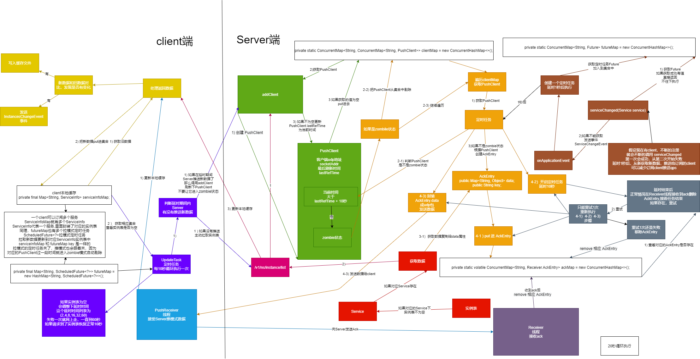
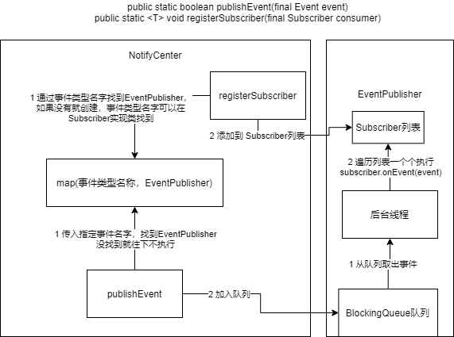

nacos 版本 1.4.1

# 客户端服务发现

todo 目前没搞清楚哪里调用

搜索了下spring-cloud-starter-alibaba-nacos-discovery包会调用

```text
ListView<String> services = namingService().getServicesOfServer(1,Integer.MAX_VALUE, group);
List<Instance> instances = namingService().selectInstances(serviceId, group,true);
```

那就重点看下以下两个方法

```java
@SuppressWarnings("PMD.ServiceOrDaoClassShouldEndWithImplRule")
public class NacosNamingService implements NamingService {
  @Override
  public List<Instance> selectInstances(String serviceName, String groupName, boolean healthy) throws NacosException {
    return selectInstances(serviceName, groupName, healthy, true);
  }
  
  @Override
  public ListView<String> getServicesOfServer(int pageNo, int pageSize, String groupName) throws NacosException {
    return getServicesOfServer(pageNo, pageSize, groupName, null);
  }

  @Override
  public List<Instance> selectInstances(String serviceName, String groupName, List<String> clusters, boolean healthy,
                                        boolean subscribe) throws NacosException {

    ServiceInfo serviceInfo;
    //true
    if (subscribe) {
      serviceInfo = hostReactor.getServiceInfo(NamingUtils.getGroupedName(serviceName, groupName),
              StringUtils.join(clusters, ","));
    } else {
      serviceInfo = hostReactor
              .getServiceInfoDirectlyFromServer(NamingUtils.getGroupedName(serviceName, groupName),
                      StringUtils.join(clusters, ","));
    }
    return selectInstances(serviceInfo, healthy);
  }
}
```

https://github.com/alibaba/nacos/issues/3181

```java
public class HostReactor implements Closeable {
    //获取服务信息
    public ServiceInfo getServiceInfo(final String serviceName, final String clusters) {

        NAMING_LOGGER.debug("failover-mode: " + failoverReactor.isFailoverSwitch());
        //获取key
        String key = ServiceInfo.getKey(serviceName, clusters);
        //默认为fasle
        if (failoverReactor.isFailoverSwitch()) {
            return failoverReactor.getService(key);
        }

        //先获取服务信息
        ServiceInfo serviceObj = getServiceInfo0(serviceName, clusters);

        //没有发现服务信息
        if (null == serviceObj) {
            serviceObj = new ServiceInfo(serviceName, clusters);

            //先放一个空的 ServiceInfo 
            serviceInfoMap.put(serviceObj.getKey(), serviceObj);

            //加入进 updatingMap，更新标志位
            updatingMap.put(serviceName, new Object());
            //更新
            updateServiceNow(serviceName, clusters);
            updatingMap.remove(serviceName);

        } else if (updatingMap.containsKey(serviceName)) {

            //更新中。。。
            if (UPDATE_HOLD_INTERVAL > 0) {
                // hold a moment waiting for update finish
                synchronized (serviceObj) {
                    try {
                        //睡眠一会等待更新完成
                        serviceObj.wait(UPDATE_HOLD_INTERVAL);
                    } catch (InterruptedException e) {
                        NAMING_LOGGER
                                .error("[getServiceInfo] serviceName:" + serviceName + ", clusters:" + clusters, e);
                    }
                }
            }
        }

        //开启拉模式
        scheduleUpdateIfAbsent(serviceName, clusters);

        return serviceInfoMap.get(serviceObj.getKey());
    }

    public void updateService(String serviceName, String clusters) throws NacosException {
        //获取旧 ServiceInfo
        ServiceInfo oldService = getServiceInfo0(serviceName, clusters);
        try {

            //get 请求 /nacos/v1/ns/instance/list
            String result = serverProxy.queryList(serviceName, clusters, pushReceiver.getUdpPort(), false);

            if (StringUtils.isNotEmpty(result)) {
                processServiceJson(result);
            }
        } finally {
            if (oldService != null) {
                synchronized (oldService) {
                    //唤醒等待的服务
                    oldService.notifyAll();
                }
            }
        }
    }

    //更新 serviceInfo
    //发送 InstancesChangeEvent 时间
    public ServiceInfo processServiceJson(String json) {
        //新数据
        ServiceInfo serviceInfo = JacksonUtils.toObj(json, ServiceInfo.class);
        //旧数据
        ServiceInfo oldService = serviceInfoMap.get(serviceInfo.getKey());

        if (pushEmptyProtection && !serviceInfo.validate()) {
            //empty or error push, just ignore
            return oldService;
        }

        boolean changed = false;

        if (oldService != null) {

            if (oldService.getLastRefTime() > serviceInfo.getLastRefTime()) {
                NAMING_LOGGER.warn("out of date data received, old-t: " + oldService.getLastRefTime() + ", new-t: "
                        + serviceInfo.getLastRefTime());
            }

            //put 进新数据
            serviceInfoMap.put(serviceInfo.getKey(), serviceInfo);

            Map<String, Instance> oldHostMap = new HashMap<String, Instance>(oldService.getHosts().size());
            for (Instance host : oldService.getHosts()) {
                oldHostMap.put(host.toInetAddr(), host);
            }

            Map<String, Instance> newHostMap = new HashMap<String, Instance>(serviceInfo.getHosts().size());
            for (Instance host : serviceInfo.getHosts()) {
                newHostMap.put(host.toInetAddr(), host);
            }

            //修改数组
            Set<Instance> modHosts = new HashSet<Instance>();
            //新增数组
            Set<Instance> newHosts = new HashSet<Instance>();
            //删除数组
            Set<Instance> remvHosts = new HashSet<Instance>();

            List<Map.Entry<String, Instance>> newServiceHosts = new ArrayList<Map.Entry<String, Instance>>(
                    newHostMap.entrySet());
            for (Map.Entry<String, Instance> entry : newServiceHosts) {
                Instance host = entry.getValue();
                String key = entry.getKey();
                if (oldHostMap.containsKey(key) && !StringUtils
                        .equals(host.toString(), oldHostMap.get(key).toString())) {
                    modHosts.add(host);
                    continue;
                }

                if (!oldHostMap.containsKey(key)) {
                    newHosts.add(host);
                }
            }

            for (Map.Entry<String, Instance> entry : oldHostMap.entrySet()) {
                Instance host = entry.getValue();
                String key = entry.getKey();
                if (newHostMap.containsKey(key)) {
                    continue;
                }

                if (!newHostMap.containsKey(key)) {
                    remvHosts.add(host);
                }

            }

            if (newHosts.size() > 0) {
                changed = true;
                NAMING_LOGGER.info("new ips(" + newHosts.size() + ") service: " + serviceInfo.getKey() + " -> "
                        + JacksonUtils.toJson(newHosts));
            }

            if (remvHosts.size() > 0) {
                changed = true;
                NAMING_LOGGER.info("removed ips(" + remvHosts.size() + ") service: " + serviceInfo.getKey() + " -> "
                        + JacksonUtils.toJson(remvHosts));
            }

            if (modHosts.size() > 0) {
                changed = true;
                updateBeatInfo(modHosts);
                NAMING_LOGGER.info("modified ips(" + modHosts.size() + ") service: " + serviceInfo.getKey() + " -> "
                        + JacksonUtils.toJson(modHosts));
            }

            serviceInfo.setJsonFromServer(json);

            if (newHosts.size() > 0 || remvHosts.size() > 0 || modHosts.size() > 0) {
                //数据变动了
                //发送事件
                NotifyCenter.publishEvent(new InstancesChangeEvent(serviceInfo.getName(), serviceInfo.getGroupName(),
                        serviceInfo.getClusters(), serviceInfo.getHosts()));
                //写到缓存文件中
                DiskCache.write(serviceInfo, cacheDir);
            }

        } else {
            changed = true;
            NAMING_LOGGER.info("init new ips(" + serviceInfo.ipCount() + ") service: " + serviceInfo.getKey() + " -> "
                    + JacksonUtils.toJson(serviceInfo.getHosts()));
            serviceInfoMap.put(serviceInfo.getKey(), serviceInfo);
            NotifyCenter.publishEvent(new InstancesChangeEvent(serviceInfo.getName(), serviceInfo.getGroupName(),
                    serviceInfo.getClusters(), serviceInfo.getHosts()));
            serviceInfo.setJsonFromServer(json);
            DiskCache.write(serviceInfo, cacheDir);
        }

        MetricsMonitor.getServiceInfoMapSizeMonitor().set(serviceInfoMap.size());

        if (changed) {
            NAMING_LOGGER.info("current ips:(" + serviceInfo.ipCount() + ") service: " + serviceInfo.getKey() + " -> "
                    + JacksonUtils.toJson(serviceInfo.getHosts()));
        }

        return serviceInfo;
    }
}
```

get 请求 /nacos/v1/ns/instance/list 参数整理了下

```text
NetUtils.localIP() = System.getProperty("com.alibaba.nacos.client.naming.local.ip",InetAddress.getLocalHost().getHostAddress());

params.put(CommonParams.NAMESPACE_ID, nacosDiscoveryProperties.getNamespace()/public);
params.put(CommonParams.SERVICE_NAME, nacosDiscoveryProperties.getGroup() + @@ + nacosDiscoveryProperties.getService());
params.put("clusters", "");
params.put("udpPort", String.valueOf(udpPort));
params.put("clientIP", NetUtils.localIP());
params.put("healthyOnly", String.valueOf(false));
```

## 定时任务

客户端拉取实例列表

这是客户端从服务端拉取实例列表，正常每10秒拉取一次

```java
public class HostReactor implements Closeable {
    public void scheduleUpdateIfAbsent(String serviceName, String clusters) {
        if (futureMap.get(ServiceInfo.getKey(serviceName, clusters)) != null) {
            return;
        }

        synchronized (futureMap) {
            if (futureMap.get(ServiceInfo.getKey(serviceName, clusters)) != null) {
                return;
            }

            ScheduledFuture<?> future = addTask(new UpdateTask(serviceName, clusters));
            futureMap.put(ServiceInfo.getKey(serviceName, clusters), future);
        }
    }

    public class UpdateTask implements Runnable {

        long lastRefTime = Long.MAX_VALUE;

        private final String clusters;

        private final String serviceName;

        /**
         * the fail situation. 1:can't connect to server 2:serviceInfo's hosts is empty
         */
        private int failCount = 0;

        public UpdateTask(String serviceName, String clusters) {
            this.serviceName = serviceName;
            this.clusters = clusters;
        }

        private void incFailCount() {
            int limit = 6;
            if (failCount == limit) {
                return;
            }
            failCount++;
        }

        private void resetFailCount() {
            failCount = 0;
        }

        @Override
        public void run() {
            long delayTime = DEFAULT_DELAY;

            try {
                ServiceInfo serviceObj = serviceInfoMap.get(ServiceInfo.getKey(serviceName, clusters));

                if (serviceObj == null) {
                    //服务为空，1秒后重新调度
                    updateService(serviceName, clusters);
                    return;
                }

                //获取的 ServiceInfo 可能就是上次拉服务更新的，那么就从服务端拉一次信息下来
                //在重新调度延时期间，有可能服务端推服务生效，导致服务信息更新了，这是else情况
                if (serviceObj.getLastRefTime() <= lastRefTime) {
                    //先更新
                    updateService(serviceName, clusters);
                    //获取最新 ServiceInfo
                    serviceObj = serviceInfoMap.get(ServiceInfo.getKey(serviceName, clusters));
                } else {
                    // if serviceName already updated by push, we should not override it
                    // since the push data may be different from pull through force push
                    //主要刷新了Server对应PushClient.lastRefTime,不获取数据
                    //说通俗点就是告诉Server我还没挂，我一直订阅你
                    refreshOnly(serviceName, clusters);
                }

                //记录下更新时间
                lastRefTime = serviceObj.getLastRefTime();

                if (!notifier.isSubscribed(serviceName, clusters) && !futureMap
                        .containsKey(ServiceInfo.getKey(serviceName, clusters))) {
                    // abort the update task
                    NAMING_LOGGER.info("update task is stopped, service:" + serviceName + ", clusters:" + clusters);
                    return;
                }
                //没有获取到实例
                if (CollectionUtils.isEmpty(serviceObj.getHosts())) {
                    //增加
                    incFailCount();
                    return;
                }
                //获取延迟时间
                delayTime = serviceObj.getCacheMillis();
                //重置
                resetFailCount();
            } catch (Throwable e) {
                incFailCount();
                NAMING_LOGGER.warn("[NA] failed to update serviceName: " + serviceName, e);
            } finally {
                //重新调度,正常10秒
                //没获取到实例表，2，4，8，16，32，60逐级延迟，一成功旧变10秒
                executor.schedule(this, Math.min(delayTime << failCount, DEFAULT_DELAY * 60), TimeUnit.MILLISECONDS);
            }
        }
    }
}
```

除了拉取实例列表外，在客户端拉取任务等待期间，正常10秒内，服务端会主动推实例列表过来，前提是实例列表有变法

我们在 GET 请求 /nacos/v1/ns/instance/list 后讲解推模式发送

这里讲解下推模式怎么接受

# PushReceiver

```java
public class PushReceiver implements Runnable, Closeable {
@Override
    public void run() {
        while (!closed) {
            try {

                // byte[] is initialized with 0 full filled by default
                byte[] buffer = new byte[UDP_MSS];
                DatagramPacket packet = new DatagramPacket(buffer, buffer.length);

                //等待接受，在这之前会睡眠
                udpSocket.receive(packet);

                String json = new String(IoUtils.tryDecompress(packet.getData()), UTF_8).trim();
                NAMING_LOGGER.info("received push data: " + json + " from " + packet.getAddress().toString());

                PushPacket pushPacket = JacksonUtils.toObj(json, PushPacket.class);
                String ack;
                if ("dom".equals(pushPacket.type) || "service".equals(pushPacket.type)) {
                    //正常都是走到这个分支
                    hostReactor.processServiceJson(pushPacket.data);

                    // send ack to server
                    ack = "{\"type\": \"push-ack\"" + ", \"lastRefTime\":\"" + pushPacket.lastRefTime + "\", \"data\":"
                            + "\"\"}";
                } else if ("dump".equals(pushPacket.type)) {
                    // dump data to server
                    ack = "{\"type\": \"dump-ack\"" + ", \"lastRefTime\": \"" + pushPacket.lastRefTime + "\", \"data\":"
                            + "\"" + StringUtils.escapeJavaScript(JacksonUtils.toJson(hostReactor.getServiceInfoMap()))
                            + "\"}";
                } else {
                    // do nothing send ack only
                    ack = "{\"type\": \"unknown-ack\"" + ", \"lastRefTime\":\"" + pushPacket.lastRefTime
                            + "\", \"data\":" + "\"\"}";
                }

                //处理结束后，给Server发送ack
                udpSocket.send(new DatagramPacket(ack.getBytes(UTF_8), ack.getBytes(UTF_8).length,
                        packet.getSocketAddress()));
            } catch (Exception e) {
                if (closed) {
                    return;
                }
                NAMING_LOGGER.error("[NA] error while receiving push data", e);
            }
        }
    }
}
```

# GET /v1/ns/instance/list

```java
@RestController
@RequestMapping(UtilsAndCommons.NACOS_NAMING_CONTEXT + "/instance")
public class InstanceController {
    @GetMapping("/list")
    @Secured(parser = NamingResourceParser.class, action = ActionTypes.READ)
    public ObjectNode list(HttpServletRequest request) throws Exception {

        String namespaceId = WebUtils.optional(request, CommonParams.NAMESPACE_ID, Constants.DEFAULT_NAMESPACE_ID);
        String serviceName = WebUtils.required(request, CommonParams.SERVICE_NAME);
        NamingUtils.checkServiceNameFormat(serviceName);

        String agent = WebUtils.getUserAgent(request);
        String clusters = WebUtils.optional(request, "clusters", StringUtils.EMPTY);
        String clientIP = WebUtils.optional(request, "clientIP", StringUtils.EMPTY);
        int udpPort = Integer.parseInt(WebUtils.optional(request, "udpPort", "0"));
        String env = WebUtils.optional(request, "env", StringUtils.EMPTY);
        boolean isCheck = Boolean.parseBoolean(WebUtils.optional(request, "isCheck", "false"));

        String app = WebUtils.optional(request, "app", StringUtils.EMPTY);

        String tenant = WebUtils.optional(request, "tid", StringUtils.EMPTY);

        boolean healthyOnly = Boolean.parseBoolean(WebUtils.optional(request, "healthyOnly", "false"));

        return doSrvIpxt(namespaceId, serviceName, agent, clusters, clientIP, udpPort, env, isCheck, app, tenant,
                healthyOnly);
    }

    public ObjectNode doSrvIpxt(String namespaceId, String serviceName, String agent, String clusters, String clientIP,
                                int udpPort, String env, boolean isCheck, String app, String tid, boolean healthyOnly) throws Exception {

        ClientInfo clientInfo = new ClientInfo(agent);
        ObjectNode result = JacksonUtils.createEmptyJsonNode();
        //获取 Service
        Service service = serviceManager.getService(namespaceId, serviceName);
        //默认3秒
        long cacheMillis = switchDomain.getDefaultCacheMillis();

        // now try to enable the push
        //服务信息推服务
        try {
            //满足情况只有 client 调用 com.alibaba.nacos.naming.controllers.InstanceController.list
            if (udpPort > 0 && pushService.canEnablePush(agent)) {

                //把参数封装成PushClient对象，加入进 clientMap
                pushService
                        .addClient(namespaceId, serviceName, clusters, agent, new InetSocketAddress(clientIP, udpPort),
                                pushDataSource, tid, app);
                //10秒
                cacheMillis = switchDomain.getPushCacheMillis(serviceName);
            }
        } catch (Exception e) {
            Loggers.SRV_LOG
                    .error("[NACOS-API] failed to added push client {}, {}:{}", clientInfo, clientIP, udpPort, e);
            cacheMillis = switchDomain.getDefaultCacheMillis();
        }

        if (service == null) {
            if (Loggers.SRV_LOG.isDebugEnabled()) {
                Loggers.SRV_LOG.debug("no instance to serve for service: {}", serviceName);
            }
            //Service 为空 ，直接返回
            result.put("name", serviceName);
            result.put("clusters", clusters);
            result.put("cacheMillis", cacheMillis);
            result.replace("hosts", JacksonUtils.createEmptyArrayNode());
            return result;
        }

        checkIfDisabled(service);

        List<Instance> srvedIPs;

        //获取指定 clusters 实例，如果没有指定 clusters ，获取 Service 所有实例
        srvedIPs = service.srvIPs(Arrays.asList(StringUtils.split(clusters, ",")));

        // filter ips using selector:
        if (service.getSelector() != null && StringUtils.isNotBlank(clientIP)) {
            srvedIPs = service.getSelector().select(clientIP, srvedIPs);
        }

        if (CollectionUtils.isEmpty(srvedIPs)) {

            if (Loggers.SRV_LOG.isDebugEnabled()) {
                Loggers.SRV_LOG.debug("no instance to serve for service: {}", serviceName);
            }

            if (clientInfo.type == ClientInfo.ClientType.JAVA
                    && clientInfo.version.compareTo(VersionUtil.parseVersion("1.0.0")) >= 0) {
                result.put("dom", serviceName);
            } else {
                result.put("dom", NamingUtils.getServiceName(serviceName));
            }

            //没有获取到实例，没注册，或者自动删除删光了
            result.put("name", serviceName);
            result.put("cacheMillis", cacheMillis);
            result.put("lastRefTime", System.currentTimeMillis());
            result.put("checksum", service.getChecksum());
            result.put("useSpecifiedURL", false);
            result.put("clusters", clusters);
            result.put("env", env);
            result.set("hosts", JacksonUtils.createEmptyArrayNode());
            result.set("metadata", JacksonUtils.transferToJsonNode(service.getMetadata()));
            return result;
        }

        Map<Boolean, List<Instance>> ipMap = new HashMap<>(2);
        ipMap.put(Boolean.TRUE, new ArrayList<>());
        ipMap.put(Boolean.FALSE, new ArrayList<>());

        //分成健康和不健康两个队列
        for (Instance ip : srvedIPs) {
            ipMap.get(ip.isHealthy()).add(ip);
        }

        if (isCheck) {
            result.put("reachProtectThreshold", false);
        }

        double threshold = service.getProtectThreshold();

        //健康的实例低于等于 threshold * 实例总数，threshold是个阈值，低于等于实例总数的百分之多少，就进入这个if
        if ((float) ipMap.get(Boolean.TRUE).size() / srvedIPs.size() <= threshold) {

            Loggers.SRV_LOG.warn("protect threshold reached, return all ips, service: {}", serviceName);
            if (isCheck) {
                result.put("reachProtectThreshold", true);
            }

            //不健康的实例列表加进健康实例列表
            ipMap.get(Boolean.TRUE).addAll(ipMap.get(Boolean.FALSE));
            //不健康列表清除
            ipMap.get(Boolean.FALSE).clear();
        }

        if (isCheck) {
            result.put("protectThreshold", service.getProtectThreshold());
            result.put("reachLocalSiteCallThreshold", false);

            return JacksonUtils.createEmptyJsonNode();
        }

        ArrayNode hosts = JacksonUtils.createEmptyArrayNode();

        for (Map.Entry<Boolean, List<Instance>> entry : ipMap.entrySet()) {
            List<Instance> ips = entry.getValue();

            if (healthyOnly && !entry.getKey()) {
                continue;
            }

            for (Instance instance : ips) {

                // remove disabled instance:
                if (!instance.isEnabled()) {
                    continue;
                }

                ObjectNode ipObj = JacksonUtils.createEmptyJsonNode();

                //封装 instance
                ipObj.put("ip", instance.getIp());
                ipObj.put("port", instance.getPort());
                // deprecated since nacos 1.0.0:
                ipObj.put("valid", entry.getKey());
                ipObj.put("healthy", entry.getKey());
                ipObj.put("marked", instance.isMarked());
                ipObj.put("instanceId", instance.getInstanceId());
                ipObj.set("metadata", JacksonUtils.transferToJsonNode(instance.getMetadata()));
                ipObj.put("enabled", instance.isEnabled());
                ipObj.put("weight", instance.getWeight());
                ipObj.put("clusterName", instance.getClusterName());
                if (clientInfo.type == ClientInfo.ClientType.JAVA
                        && clientInfo.version.compareTo(VersionUtil.parseVersion("1.0.0")) >= 0) {
                    ipObj.put("serviceName", instance.getServiceName());
                } else {
                    ipObj.put("serviceName", NamingUtils.getServiceName(instance.getServiceName()));
                }

                ipObj.put("ephemeral", instance.isEphemeral());
                hosts.add(ipObj);

            }
        }

        //构造剩下的值返回
        result.replace("hosts", hosts);
        if (clientInfo.type == ClientInfo.ClientType.JAVA
                && clientInfo.version.compareTo(VersionUtil.parseVersion("1.0.0")) >= 0) {
            result.put("dom", serviceName);
        } else {
            result.put("dom", NamingUtils.getServiceName(serviceName));
        }
        result.put("name", serviceName);
        result.put("cacheMillis", cacheMillis);
        result.put("lastRefTime", System.currentTimeMillis());
        result.put("checksum", service.getChecksum());
        result.put("useSpecifiedURL", false);
        result.put("clusters", clusters);
        result.put("env", env);
        result.replace("metadata", JacksonUtils.transferToJsonNode(service.getMetadata()));
        return result;
    }
}
```

在实例注册，或者删除实例中,会出现这些代码，这个代码就是服务端主动把变化了的实例列表推送给客户端

```text
getPushService().serviceChanged(service);
```

客户端定期拉取任务中，会每10秒调用 GET /v1/ns/instance/list 请求，在这个请求中，我们看到调用了

PushService#addClient，把参数封装成PushClient对象加到 clientMap 集合中

问题是为什么定时任务要不断调用 addClient 加入到 clientMap 集合中呢？

答案是因为，如果客户端不在订阅某个服务了，这个时候 PushClient.lastRefTime 时间就不会一直更新，推模式执行时

会判断当前时间 是否大于 PushClient.lastRefTime 加上10秒，如果是，就证明客户端不在订阅实例表了，我们不用把实例表推送给不订阅的客户端

接着把 PushClient 从 clientMap 集合中提走

```java
public class PushService implements ApplicationContextAware, ApplicationListener<ServiceChangeEvent> {

    public void addClient(String namespaceId, String serviceName, String clusters, String agent,
                          InetSocketAddress socketAddr, DataSource dataSource, String tenant, String app) {

        PushClient client = new PushClient(namespaceId, serviceName, clusters, agent, socketAddr, dataSource, tenant,
                app);
        addClient(client);
    }

    public void addClient(PushClient client) {
        // client is stored by key 'serviceName' because notify event is driven by serviceName change
        String serviceKey = UtilsAndCommons.assembleFullServiceName(client.getNamespaceId(), client.getServiceName());
        ConcurrentMap<String, PushClient> clients = clientMap.get(serviceKey);
        if (clients == null) {
            clientMap.putIfAbsent(serviceKey, new ConcurrentHashMap<>(1024));
            clients = clientMap.get(serviceKey);
        }

        PushClient oldClient = clients.get(client.toString());
        if (oldClient != null) {
            oldClient.refresh();
        } else {
            PushClient res = clients.putIfAbsent(client.toString(), client);
            if (res != null) {
                Loggers.PUSH.warn("client: {} already associated with key {}", res.getAddrStr(), res.toString());
            }
            Loggers.PUSH.debug("client: {} added for serviceName: {}", client.getAddrStr(), client.getServiceName());
        }
    }
    
    public void serviceChanged(Service service) {
        // merge some change events to reduce the push frequency:
        //等下会看到onApplicationEvent方法定时任务是延时1秒后执行的，并且加紧 futureMap 中
        //就是说在这1秒内假设有实例疯狂注册，也不会立刻执行，等延时1秒后，
        //在读取新数据，这里的新数据就包括了1秒内疯狂注册的新实例列表
        //减少 client 推模式qps
        if (futureMap
                .containsKey(UtilsAndCommons.assembleFullServiceName(service.getNamespaceId(), service.getName()))) {
            return;
        }
        
        //发送事件
        this.applicationContext.publishEvent(new ServiceChangeEvent(this, service));
    }

    @Override
    public void onApplicationEvent(ServiceChangeEvent event) {
        Service service = event.getService();
        String serviceName = service.getName();
        String namespaceId = service.getNamespaceId();
        
        Future future = GlobalExecutor.scheduleUdpSender(() -> {
            try {
                Loggers.PUSH.info(serviceName + " is changed, add it to push queue.");
                //获取 clients
                ConcurrentMap<String, PushClient> clients = clientMap
                        .get(UtilsAndCommons.assembleFullServiceName(namespaceId, serviceName));
                //如果为空不执行
                if (MapUtils.isEmpty(clients)) {
                    return;
                }

                Map<String, Object> cache = new HashMap<>(16);
                long lastRefTime = System.nanoTime();
                for (PushClient client : clients.values()) {
                    //客户端注册时间大于当前时间的10秒，则不在执行
                    if (client.zombie()) {
                        Loggers.PUSH.debug("client is zombie: " + client.toString());
                        clients.remove(client.toString());
                        Loggers.PUSH.debug("client is zombie: " + client.toString());
                        continue;
                    }

                    Receiver.AckEntry ackEntry;
                    Loggers.PUSH.debug("push serviceName: {} to client: {}", serviceName, client.toString());
                    String key = getPushCacheKey(serviceName, client.getIp(), client.getAgent());
                    byte[] compressData = null;
                    Map<String, Object> data = null;
                    if (switchDomain.getDefaultPushCacheMillis() >= 20000 && cache.containsKey(key)) {
                        org.javatuples.Pair pair = (org.javatuples.Pair) cache.get(key);
                        compressData = (byte[]) (pair.getValue0());
                        data = (Map<String, Object>) pair.getValue1();

                        Loggers.PUSH.debug("[PUSH-CACHE] cache hit: {}:{}", serviceName, client.getAddrStr());
                    }

                    //封装 ackEntry
                    if (compressData != null) {
                        ackEntry = prepareAckEntry(client, compressData, data, lastRefTime);
                    } else {
                        ackEntry = prepareAckEntry(client, prepareHostsData(client), lastRefTime);
                        if (ackEntry != null) {
                            //正常不会等于null ackEntry.origin.getData() 和 ackEntry.data 数据是一样的
                            //ackEntry.origin.getData() 是字节数组，ackEntry.data 是map集合
                            cache.put(key, new org.javatuples.Pair<>(ackEntry.origin.getData(), ackEntry.data));
                        }
                    }

                    Loggers.PUSH.info("serviceName: {} changed, schedule push for: {}, agent: {}, key: {}",
                            client.getServiceName(), client.getAddrStr(), client.getAgent(),
                            (ackEntry == null ? null : ackEntry.key));

                    //把实例表发送给订阅的客户端
                    udpPush(ackEntry);
                }
            } catch (Exception e) {
                Loggers.PUSH.error("[NACOS-PUSH] failed to push serviceName: {} to client, error: {}", serviceName, e);

            } finally {
                futureMap.remove(UtilsAndCommons.assembleFullServiceName(namespaceId, serviceName));
            }

        }, 1000, TimeUnit.MILLISECONDS);

        futureMap.put(UtilsAndCommons.assembleFullServiceName(namespaceId, serviceName), future);

    }

    private static Receiver.AckEntry udpPush(Receiver.AckEntry ackEntry) {
        if (ackEntry == null) {
            Loggers.PUSH.error("[NACOS-PUSH] ackEntry is null.");
            return null;
        }

        //重试1次，正常会发送1次，没收到ack就认为是失败了,那么就重试1次，如果还是失败了，会进入这个if
        if (ackEntry.getRetryTimes() > MAX_RETRY_TIMES) {
            Loggers.PUSH.warn("max re-push times reached, retry times {}, key: {}", ackEntry.retryTimes, ackEntry.key);
            ackMap.remove(ackEntry.key);
            udpSendTimeMap.remove(ackEntry.key);
            //统计
            failedPush += 1;
            return ackEntry;
        }

        try {
            if (!ackMap.containsKey(ackEntry.key)) {
                //统计
                totalPush++;
            }
            //put 进集合
            ackMap.put(ackEntry.key, ackEntry);
            udpSendTimeMap.put(ackEntry.key, System.currentTimeMillis());

            Loggers.PUSH.info("send udp packet: " + ackEntry.key);
            //发送
            udpSocket.send(ackEntry.origin);

            //重试加1
            ackEntry.increaseRetryTime();

            //延迟10秒
            GlobalExecutor.scheduleRetransmitter(new Retransmitter(ackEntry),
                    TimeUnit.NANOSECONDS.toMillis(ACK_TIMEOUT_NANOS), TimeUnit.MILLISECONDS);

            return ackEntry;
        } catch (Exception e) {
            //如果有异常，终止这次推送
            Loggers.PUSH.error("[NACOS-PUSH] failed to push data: {} to client: {}, error: {}", ackEntry.data,
                    ackEntry.origin.getAddress().getHostAddress(), e);
            ackMap.remove(ackEntry.key);
            udpSendTimeMap.remove(ackEntry.key);
            failedPush += 1;

            return null;
        }
    }

    public static class Retransmitter implements Runnable {

        Receiver.AckEntry ackEntry;

        public Retransmitter(Receiver.AckEntry ackEntry) {
            this.ackEntry = ackEntry;
        }

        @Override
        public void run() {
            //收到ack,后会从ackMap删除，不会在进入这个if中
            if (ackMap.containsKey(ackEntry.key)) {
                Loggers.PUSH.info("retry to push data, key: " + ackEntry.key);
                udpPush(ackEntry);
            }
        }
    }

    public static class Receiver implements Runnable {

        @Override
        public void run() {
            while (true) {
                byte[] buffer = new byte[1024 * 64];
                DatagramPacket packet = new DatagramPacket(buffer, buffer.length);

                try {
                    udpSocket.receive(packet);

                    String json = new String(packet.getData(), 0, packet.getLength(), StandardCharsets.UTF_8).trim();
                    AckPacket ackPacket = JacksonUtils.toObj(json, AckPacket.class);

                    InetSocketAddress socketAddress = (InetSocketAddress) packet.getSocketAddress();
                    String ip = socketAddress.getAddress().getHostAddress();
                    int port = socketAddress.getPort();

                    if (System.nanoTime() - ackPacket.lastRefTime > ACK_TIMEOUT_NANOS) {
                        Loggers.PUSH.warn("ack takes too long from {} ack json: {}", packet.getSocketAddress(), json);
                    }

                    String ackKey = getAckKey(ip, port, ackPacket.lastRefTime);
                    //就是这里，删除
                    AckEntry ackEntry = ackMap.remove(ackKey);
                    if (ackEntry == null) {
                        throw new IllegalStateException(
                                "unable to find ackEntry for key: " + ackKey + ", ack json: " + json);
                    }

                    long pushCost = System.currentTimeMillis() - udpSendTimeMap.get(ackKey);

                    Loggers.PUSH
                            .info("received ack: {} from: {}:{}, cost: {} ms, unacked: {}, total push: {}", json, ip,
                                    port, pushCost, ackMap.size(), totalPush);

                    pushCostMap.put(ackKey, pushCost);

                    udpSendTimeMap.remove(ackKey);

                } catch (Throwable e) {
                    Loggers.PUSH.error("[NACOS-PUSH] error while receiving ack data", e);
                }
            }
        }
    }
}
```



todo InstancesChangeEvent 没画出来，有空在画

InstancesChangeEvent 怎么使用?

nacos源码有这个例子 com.alibaba.nacos.example.NamingExample

```java
/**
 * Nacos naming example.
 *
 * @author nkorange
 */
public class NamingExample {
    
    public static void main(String[] args) throws NacosException {
        
        Properties properties = new Properties();
        properties.setProperty("serverAddr", System.getProperty("serverAddr"));
        properties.setProperty("namespace", System.getProperty("namespace"));
        
        //创建 NamingService
        NamingService naming = NamingFactory.createNamingService(properties);
        
        //注册实例
        naming.registerInstance("nacos.test.3", "11.11.11.11", 8888, "TEST1");
        
        naming.registerInstance("nacos.test.3", "2.2.2.2", 9999, "DEFAULT");
        
        System.out.println(naming.getAllInstances("nacos.test.3"));
        
        naming.deregisterInstance("nacos.test.3", "2.2.2.2", 9999, "DEFAULT");
        
        System.out.println(naming.getAllInstances("nacos.test.3"));
        
        Executor executor = new ThreadPoolExecutor(1, 1, 0L, TimeUnit.MILLISECONDS, new LinkedBlockingQueue<Runnable>(),
                new ThreadFactory() {
                    @Override
                    public Thread newThread(Runnable r) {
                        Thread thread = new Thread(r);
                        thread.setName("test-thread");
                        return thread;
                    }
                });
        
        //就是这个，一旦收到 InstancesChangeEvent ，onEvent 就会被调用，观察者模式
        naming.subscribe("nacos.test.3", new AbstractEventListener() {
            
            //EventListener onEvent is sync to handle, If process too low in onEvent, maybe block other onEvent callback.
            //So you can override getExecutor() to async handle event.
            @Override
            public Executor getExecutor() {
                return executor;
            }
            
            @Override
            public void onEvent(Event event) {
                System.out.println(((NamingEvent) event).getServiceName());
                System.out.println(((NamingEvent) event).getInstances());
            }
        });
    }
}
```

# NotifyCenter 简单介绍

