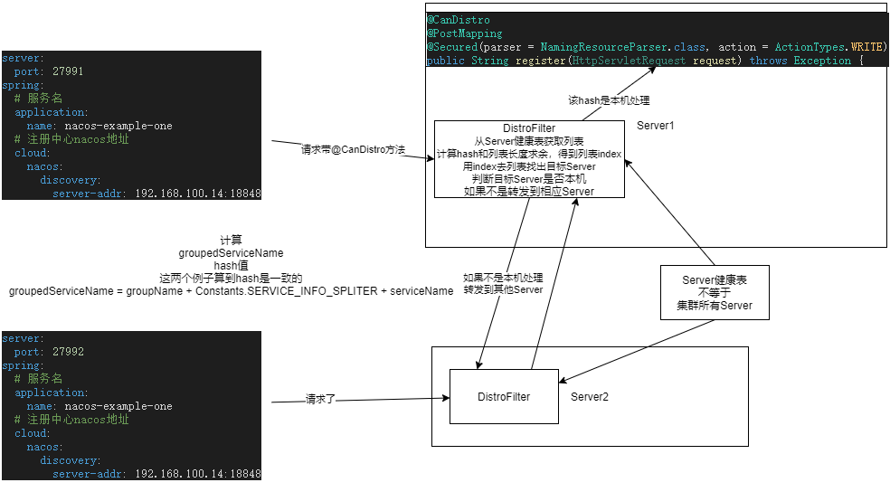

nacos 版本 1.4.1

# ServerMemberManager

集群管理类

```java
@Component(value = "serverMemberManager")
public class ServerMemberManager implements ApplicationListener<WebServerInitializedEvent> {

    private final NacosAsyncRestTemplate asyncRestTemplate = HttpClientBeanHolder
            .getNacosAsyncRestTemplate(Loggers.CORE);

    /**
     * Cluster node list.
     * 集群节点列表
     */
    private volatile ConcurrentSkipListMap<String, Member> serverList;

    /**
     * Is this node in the cluster list.
     * 当前节点是否在集群中
     */
    private volatile boolean isInIpList = true;

    /**
     * port.
     * 当前节点端口
     */
    private int port;

    /**
     * Address information for the local node.
     * 当前节点地址
     */
    private String localAddress;

    /**
     * Addressing pattern instances.
     * 发现集群其他节点的方式
     */
    private MemberLookup lookup;

    /**
     * self member obj.
     * 本机 member
     */
    private volatile Member self;

    /**
     * here is always the node information of the "UP" state.
     * 节点都是UP状态列表
     */
    private volatile Set<String> memberAddressInfos = new ConcurrentHashSet<>();

    /**
     * Broadcast this node element information task.
     * 广播此节点元素信息任务。
     */
    private final MemberInfoReportTask infoReportTask = new MemberInfoReportTask();

    public ServerMemberManager(ServletContext servletContext) throws Exception {
        this.serverList = new ConcurrentSkipListMap<>();
        EnvUtil.setContextPath(servletContext.getContextPath());

        init();
    }

    protected void init() throws NacosException {
        Loggers.CORE.info("Nacos-related cluster resource initialization");
        //初始化参数
        this.port = EnvUtil.getProperty("server.port", Integer.class, 8848);
        this.localAddress = InetUtils.getSelfIP() + ":" + port;
        this.self = MemberUtil.singleParse(this.localAddress);
        this.self.setExtendVal(MemberMetaDataConstants.VERSION, VersionUtils.version);
        serverList.put(self.getAddress(), self);

        // register NodeChangeEvent publisher to NotifyManager
        registerClusterEvent();

        // Initializes the lookup mode
        initAndStartLookup();

        if (serverList.isEmpty()) {
            throw new NacosException(NacosException.SERVER_ERROR, "cannot get serverlist, so exit.");
        }

        Loggers.CORE.info("The cluster resource is initialized");
    }

    private void initAndStartLookup() throws NacosException {
        //创建 MemberLookup
        this.lookup = LookupFactory.createLookUp(this);
        this.lookup.start();
    }
}
```

```java
public final class LookupFactory {

    private static final String LOOKUP_MODE_TYPE = "nacos.core.member.lookup.type";

    @SuppressWarnings("checkstyle:StaticVariableName")
    private static MemberLookup LOOK_UP = null;

    private static LookupType currentLookupType = null;

    /**
     * Create the target addressing pattern.
     *
     * @param memberManager {@link ServerMemberManager}
     * @return {@link MemberLookup}
     * @throws NacosException NacosException
     */
    public static MemberLookup createLookUp(ServerMemberManager memberManager) throws NacosException {
        if (!EnvUtil.getStandaloneMode()) {
            //从 nacos.core.member.lookup.type 读取集群寻址模式
            String lookupType = EnvUtil.getProperty(LOOKUP_MODE_TYPE);
            //默认 file，可以选择 address-server
            LookupType type = chooseLookup(lookupType);
            //创建 MemberLookup
            LOOK_UP = find(type);
            currentLookupType = type;
        } else {
            LOOK_UP = new StandaloneMemberLookup();
        }
        LOOK_UP.injectMemberManager(memberManager);
        Loggers.CLUSTER.info("Current addressing mode selection : {}", LOOK_UP.getClass().getSimpleName());
        return LOOK_UP;
    }
}
```

FileConfigMemberLookup

```java
public class FileConfigMemberLookup extends AbstractMemberLookup {

    private FileWatcher watcher = new FileWatcher() {
        @Override
        public void onChange(FileChangeEvent event) {
            readClusterConfFromDisk();
        }

        @Override
        public boolean interest(String context) {
            return StringUtils.contains(context, "cluster.conf");
        }
    };

    @Override
    public void start() throws NacosException {
        if (start.compareAndSet(false, true)) {
            readClusterConfFromDisk();

            // Use the inotify mechanism to monitor file changes and automatically
            // trigger the reading of cluster.conf
            try {
                //监听 cluster.conf 是否改变
                WatchFileCenter.registerWatcher(EnvUtil.getConfPath(), watcher);
            } catch (Throwable e) {
                Loggers.CLUSTER.error("An exception occurred in the launch file monitor : {}", e.getMessage());
            }
        }
    }

    private void readClusterConfFromDisk() {
        Collection<Member> tmpMembers = new ArrayList<>();
        try {
            //读取集群地址
            List<String> tmp = EnvUtil.readClusterConf();
            //封装成 Member
            tmpMembers = MemberUtil.readServerConf(tmp);
        } catch (Throwable e) {
            Loggers.CLUSTER
                    .error("nacos-XXXX [serverlist] failed to get serverlist from disk!, error : {}", e.getMessage());
        }

        afterLookup(tmpMembers);
    }
}

public abstract class AbstractMemberLookup implements MemberLookup {

    protected ServerMemberManager memberManager;

    protected AtomicBoolean start = new AtomicBoolean(false);

    @Override
    public void injectMemberManager(ServerMemberManager memberManager) {
        this.memberManager = memberManager;
    }

    @Override
    public void afterLookup(Collection<Member> members) {
        //最后调用了 memberChange
        this.memberManager.memberChange(members);
    }

    @Override
    public void destroy() throws NacosException {

    }
}
```

```java
@Component(value = "serverMemberManager")
public class ServerMemberManager implements ApplicationListener<WebServerInitializedEvent> {

    synchronized boolean memberChange(Collection<Member> members) {

        if (members == null || members.isEmpty()) {
            return false;
        }

        boolean isContainSelfIp = members.stream()
                .anyMatch(ipPortTmp -> Objects.equals(localAddress, ipPortTmp.getAddress()));

        if (isContainSelfIp) {
            isInIpList = true;
        } else {
            isInIpList = false;
            members.add(this.self);
            Loggers.CLUSTER.warn("[serverlist] self ip {} not in serverlist {}", self, members);
        }

        // If the number of old and new clusters is different, the cluster information
        // must have changed; if the number of clusters is the same, then compare whether
        // there is a difference; if there is a difference, then the cluster node changes
        // are involved and all recipients need to be notified of the node change event

        boolean hasChange = members.size() != serverList.size();
        ConcurrentSkipListMap<String, Member> tmpMap = new ConcurrentSkipListMap<>();
        Set<String> tmpAddressInfo = new ConcurrentHashSet<>();
        for (Member member : members) {
            final String address = member.getAddress();

            if (!serverList.containsKey(address)) {
                hasChange = true;
            }

            // Ensure that the node is created only once
            tmpMap.put(address, member);
            if (NodeState.UP.equals(member.getState())) {
                tmpAddressInfo.add(address);
            }
        }

        //更新 serverList memberAddressInfos
        serverList = tmpMap;
        memberAddressInfos = tmpAddressInfo;

        Collection<Member> finalMembers = allMembers();

        Loggers.CLUSTER.warn("[serverlist] updated to : {}", finalMembers);

        // Persist the current cluster node information to cluster.conf
        // <important> need to put the event publication into a synchronized block to ensure
        // that the event publication is sequential
        // 将当前集群节点信息持久化为cluster.conf <important>需要将事件发布放入同步块中，以确保事件发布是连续的
        //如果节点发生了变化
        if (hasChange) {
            //同步到文件
            MemberUtil.syncToFile(finalMembers);
            Event event = MembersChangeEvent.builder().members(finalMembers).build();
            //发送事件
            NotifyCenter.publishEvent(event);
        }

        return hasChange;
    }
}
```

只要继承 MemberChangeListener 类就能接受 MembersChangeEvent 事件，以下是 MemberChangeListener 子类

```text
ProtocolManager
ServerListManager
RaftPeerSet
DistroMapper
```

RaftPeerSet 和 ServerListManager 准备废弃了，不看

todo ProtocolManager 和持久化实例有关

重点看 DistroMapper

```java
@Component("distroMapper")
public class DistroMapper extends MemberChangeListener {

    /**
     * List of service nodes, you must ensure that the order of healthyList is the same for all nodes.
     * 服务节点列表，必须确保所有节点的healthyList顺序相同。
     */
    private volatile List<String> healthyList = new ArrayList<>();

    private final SwitchDomain switchDomain;

    private final ServerMemberManager memberManager;

    public DistroMapper(ServerMemberManager memberManager, SwitchDomain switchDomain) {
        this.memberManager = memberManager;
        this.switchDomain = switchDomain;
    }

    public List<String> getHealthyList() {
        return healthyList;
    }

    /**
     * init server list.
     */
    @PostConstruct
    public void init() {
        NotifyCenter.registerSubscriber(this);
        this.healthyList = MemberUtil.simpleMembers(memberManager.allMembers());
    }

    @Override
    public void onEvent(MembersChangeEvent event) {
        // Here, the node list must be sorted to ensure that all nacos-server's
        // node list is in the same order
        //过滤出是 NodeState.UP 或 NodeState.SUSPICIOUS 状态的节点，原因在 ServerMemberManager 定时任务简介
        List<String> list = MemberUtil.simpleMembers(MemberUtil.selectTargetMembers(event.getMembers(),
                member -> NodeState.UP.equals(member.getState()) || NodeState.SUSPICIOUS.equals(member.getState())));
        //必须排序，确保所有服务节点列表顺序都是一样，原因后面 DistroFilter 讲解
        Collections.sort(list);
        Collection<String> old = healthyList;
        healthyList = Collections.unmodifiableList(list);
        Loggers.SRV_LOG.info("[NACOS-DISTRO] healthy server list changed, old: {}, new: {}", old, healthyList);
    }

}

```

com.alibaba.nacos.core.cluster.lookup.FileConfigMemberLookup#start最后会监听 cluster.conf 是否改变， 如果修改了，会重新执行 com.alibaba.nacos.core.cluster.lookup.FileConfigMemberLookup#readClusterConfFromDisk

这些逻辑可以参考 com.alibaba.nacos.sys.file.WatchFileCenter#registerWatcher

这里有个问题就是，修改 cluster.conf 只有本地Server知道，其他Server是不知道的，所以其他Server也要一同修改

## ServerMemberManager 定时任务

com.alibaba.nacos.core.cluster.ServerMemberManager 继承了 ApplicationListener<WebServerInitializedEvent> 初始化会接受事件，接下来我们看看代码

```java
@Component(value = "serverMemberManager")
public class ServerMemberManager implements ApplicationListener<WebServerInitializedEvent> {
    @Override
    public void onApplicationEvent(WebServerInitializedEvent event) {
        getSelf().setState(NodeState.UP);
        if (!EnvUtil.getStandaloneMode()) {
            //启动定时任务每2秒循环请求集群节点，主动检测其他节点是否能通信
            GlobalExecutor.scheduleByCommon(this.infoReportTask, 5_000L);
        }
        //设置 端口和地址
        EnvUtil.setPort(event.getWebServer().getPort());
        EnvUtil.setLocalAddress(this.localAddress);
        Loggers.CLUSTER.info("This node is ready to provide external services");
    }

    class MemberInfoReportTask extends Task {

        private final GenericType<RestResult<String>> reference = new GenericType<RestResult<String>>() {
        };

        private int cursor = 0;

        @Override
        protected void executeBody() {
            //获取除本Server其他节点
            List<Member> members = ServerMemberManager.this.allMembersWithoutSelf();

            if (members.isEmpty()) {
                return;
            }

            //轮询节点
            this.cursor = (this.cursor + 1) % members.size();
            Member target = members.get(cursor);

            Loggers.CLUSTER.debug("report the metadata to the node : {}", target.getAddress());

            final String url = HttpUtils
                    .buildUrl(false, target.getAddress(), EnvUtil.getContextPath(), Commons.NACOS_CORE_CONTEXT,
                            "/cluster/report");

            try {
                asyncRestTemplate
                        .post(url, Header.newInstance().addParam(Constants.NACOS_SERVER_HEADER, VersionUtils.version),
                                Query.EMPTY, getSelf(), reference.getType(), new Callback<String>() {
                                    @Override
                                    public void onReceive(RestResult<String> result) {
                                        if (result.getCode() == HttpStatus.NOT_IMPLEMENTED.value()
                                                || result.getCode() == HttpStatus.NOT_FOUND.value()) {
                                            //警告解释了
                                            Loggers.CLUSTER
                                                    .warn("{} version is too low, it is recommended to upgrade the version : {}",
                                                            target, VersionUtils.version);
                                            return;
                                        }
                                        if (result.ok()) {
                                            //成功逻辑
                                            MemberUtil.onSuccess(ServerMemberManager.this, target);
                                        } else {
                                            Loggers.CLUSTER
                                                    .warn("failed to report new info to target node : {}, result : {}",
                                                            target.getAddress(), result);
                                            //失败
                                            MemberUtil.onFail(ServerMemberManager.this, target);
                                        }
                                    }

                                    @Override
                                    public void onError(Throwable throwable) {
                                        Loggers.CLUSTER
                                                .error("failed to report new info to target node : {}, error : {}",
                                                        target.getAddress(),
                                                        ExceptionUtil.getAllExceptionMsg(throwable));
                                        //失败
                                        MemberUtil.onFail(ServerMemberManager.this, target, throwable);
                                    }

                                    @Override
                                    public void onCancel() {

                                    }
                                });
            } catch (Throwable ex) {
                Loggers.CLUSTER.error("failed to report new info to target node : {}, error : {}", target.getAddress(),
                        ExceptionUtil.getAllExceptionMsg(ex));
            }
        }

        @Override
        protected void after() {
            //重新调度
            GlobalExecutor.scheduleByCommon(this, 2_000L);
        }
    }
}
```

```java
public class MemberUtil {
    public static void onSuccess(final ServerMemberManager manager, final Member member) {
        //请求成功，证明被请求Server能够正常通信
        final NodeState old = member.getState();
        //设置被请求Server状态 NodeState.UP
        manager.getMemberAddressInfos().add(member.getAddress());
        member.setState(NodeState.UP);
        member.setFailAccessCnt(0);
        if (!Objects.equals(old, member.getState())) {
            //如果状态不一致，发送事件
            manager.notifyMemberChange();
        }
    }

    public static void onFail(final ServerMemberManager manager, final Member member, Throwable ex) {
        //请求失败，被请求节点不能通信
        //移除被请求Server
        manager.getMemberAddressInfos().remove(member.getAddress());
        final NodeState old = member.getState();
        //设置状态  NodeState.SUSPICIOUS
        member.setState(NodeState.SUSPICIOUS);
        //失败次数加1
        member.setFailAccessCnt(member.getFailAccessCnt() + 1);
        int maxFailAccessCnt = EnvUtil.getProperty("nacos.core.member.fail-access-cnt", Integer.class, 3);

        // If the number of consecutive failures to access the target node reaches
        // a maximum, or the link request is rejected, the state is directly down
        //失败次数超过 maxFailAccessCnt 设置状态 NodeState.DOWN
        if (member.getFailAccessCnt() > maxFailAccessCnt || StringUtils
                .containsIgnoreCase(ex.getMessage(), TARGET_MEMBER_CONNECT_REFUSE_ERRMSG)) {
            member.setState(NodeState.DOWN);
        }
        if (!Objects.equals(old, member.getState())) {
            //状态改变，发送事件
            manager.notifyMemberChange();
        }
    }
}
```

在 DistroMapper 接受事件中，可以看到过滤出 NodeState.UP 或 NodeState.SUSPICIOUS 状态的节点，nacos 把 NodeState.SUSPICIOUS 也认为可以正常通信

我猜测这么做，可能考虑到网络抖动带来的短暂通信失败，不代表节点真的挂了

# DistroFilter

com.alibaba.nacos.naming.web.NamingConfig 初始化 DistroFilter 过滤器

功能和一致性hash负载均衡很相似，先计算服务名hash值，在和集群列表长度求余获取请求服务的index，这样客户端随便请求Server每次请求都能请求到同一个服务

逻辑简单，不贴代码了



# ServiceManager

```java
@Component
public class ServiceManager implements RecordListener<Service> {
    
    /**
     * Init service maneger.
     */
    @PostConstruct
    public void init() {
        GlobalExecutor.scheduleServiceReporter(new ServiceReporter(), 60000, TimeUnit.MILLISECONDS);

        GlobalExecutor.submitServiceUpdateManager(new UpdatedServiceProcessor());

        if (emptyServiceAutoClean) {

            Loggers.SRV_LOG.info("open empty service auto clean job, initialDelay : {} ms, period : {} ms",
                    cleanEmptyServiceDelay, cleanEmptyServicePeriod);

            // delay 60s, period 20s;

            // This task is not recommended to be performed frequently in order to avoid
            // the possibility that the service cache information may just be deleted
            // and then created due to the heartbeat mechanism

            GlobalExecutor.scheduleServiceAutoClean(new EmptyServiceAutoClean(), cleanEmptyServiceDelay,
                    cleanEmptyServicePeriod);
        }

        try {
            Loggers.SRV_LOG.info("listen for service meta change");
            consistencyService.listen(KeyBuilder.SERVICE_META_KEY_PREFIX, this);
        } catch (NacosException e) {
            Loggers.SRV_LOG.error("listen for service meta change failed!");
        }
    }
}
```

这里涉及两个定时任务和1个线程

## 定时任务

每60秒循环执行ServiceReporter,遍历当前服务所有Server,并计算相应 checksum ，把 checksum 封装成消息，广播发送给其他服务 

```java
@Component
public class ServiceManager implements RecordListener<Service> {
    private class ServiceReporter implements Runnable {

        @Override
        public void run() {
            try {

                //Map(namespace, Set(group::serviceName)).
                Map<String, Set<String>> allServiceNames = getAllServiceNames();

                if (allServiceNames.size() <= 0) {
                    //ignore
                    return;
                }

                for (String namespaceId : allServiceNames.keySet()) {

                    ServiceChecksum checksum = new ServiceChecksum(namespaceId);

                    //遍历 serviceName
                    for (String serviceName : allServiceNames.get(namespaceId)) {
                        //不属于当前节点serviceName不处理
                        if (!distroMapper.responsible(serviceName)) {
                            continue;
                        }

                        //获取 Service
                        Service service = getService(namespaceId, serviceName);

                        if (service == null || service.isEmpty()) {
                            continue;
                        }

                        //计算 Service Checksum
                        service.recalculateChecksum();

                        //加入 checksum
                        checksum.addItem(serviceName, service.getChecksum());
                    }

                    //构造 Message
                    Message msg = new Message();

                    //设置
                    msg.setData(JacksonUtils.toJson(checksum));

                    Collection<Member> sameSiteServers = memberManager.allMembers();

                    if (sameSiteServers == null || sameSiteServers.size() <= 0) {
                        return;
                    }

                    //遍历其他 Server 节点
                    for (Member server : sameSiteServers) {
                        if (server.getAddress().equals(NetUtils.localServer())) {
                            continue;
                        }
                        //发送
                        synchronizer.send(server.getAddress(), msg);
                    }
                }
            } catch (Exception e) {
                Loggers.SRV_LOG.error("[DOMAIN-STATUS] Exception while sending service status", e);
            } finally {
                GlobalExecutor.scheduleServiceReporter(this, switchDomain.getServiceStatusSynchronizationPeriodMillis(),
                        TimeUnit.MILLISECONDS);
            }
        }
    }
}
```

```java
public class ServiceStatusSynchronizer implements Synchronizer {

    @Override
    public void send(final String serverIP, Message msg) {
        if (serverIP == null) {
            return;
        }

        Map<String, String> params = new HashMap<String, String>(10);

        params.put("statuses", msg.getData());
        params.put("clientIP", NetUtils.localServer());

        String url = "http://" + serverIP + ":" + EnvUtil.getPort() + EnvUtil.getContextPath()
                + UtilsAndCommons.NACOS_NAMING_CONTEXT + "/service/status";

        if (IPUtil.containsPort(serverIP)) {
            url = "http://" + serverIP + EnvUtil.getContextPath() + UtilsAndCommons.NACOS_NAMING_CONTEXT
                    + "/service/status";
        }

        try {
            //Post 请求  /nacos/v1/ns/service/status
            HttpClient.asyncHttpPostLarge(url, null, JacksonUtils.toJson(params), new Callback<String>() {
                @Override
                public void onReceive(RestResult<String> result) {
                    if (!result.ok()) {
                        Loggers.SRV_LOG.warn("[STATUS-SYNCHRONIZE] failed to request serviceStatus, remote server: {}",
                                serverIP);

                    }
                }

                @Override
                public void onError(Throwable throwable) {
                    Loggers.SRV_LOG.warn("[STATUS-SYNCHRONIZE] failed to request serviceStatus, remote server: " + serverIP, throwable);
                }

                @Override
                public void onCancel() {

                }
            });
        } catch (Exception e) {
            Loggers.SRV_LOG.warn("[STATUS-SYNCHRONIZE] failed to request serviceStatus, remote server: " + serverIP, e);
        }

    }
}

```

todo EmptyServiceAutoClean 好像和持久化实例有关

## 开启线程

```java
@Component
public class ServiceManager implements RecordListener<Service> {

    private final LinkedBlockingDeque<ServiceKey> toBeUpdatedServicesQueue = new LinkedBlockingDeque<>(1024 * 1024);
    
    private class UpdatedServiceProcessor implements Runnable {

        //get changed service from other server asynchronously
        @Override
        public void run() {
            ServiceKey serviceKey = null;

            try {
                while (true) {
                    try {
                        //
                        serviceKey = toBeUpdatedServicesQueue.take();
                    } catch (Exception e) {
                        Loggers.EVT_LOG.error("[UPDATE-DOMAIN] Exception while taking item from LinkedBlockingDeque.");
                    }

                    if (serviceKey == null) {
                        continue;
                    }
                    GlobalExecutor.submitServiceUpdate(new ServiceUpdater(serviceKey));
                }
            } catch (Exception e) {
                Loggers.EVT_LOG.error("[UPDATE-DOMAIN] Exception while update service: {}", serviceKey, e);
            }
        }
    }

    private class ServiceUpdater implements Runnable {

        String namespaceId;

        String serviceName;

        String serverIP;

        public ServiceUpdater(ServiceKey serviceKey) {
            this.namespaceId = serviceKey.getNamespaceId();
            this.serviceName = serviceKey.getServiceName();
            this.serverIP = serviceKey.getServerIP();
        }

        @Override
        public void run() {
            try {
                updatedHealthStatus(namespaceId, serviceName, serverIP);
            } catch (Exception e) {
                Loggers.SRV_LOG
                        .warn("[DOMAIN-UPDATER] Exception while update service: {} from {}, error: {}", serviceName,
                                serverIP, e);
            }
        }
    }

    public void updatedHealthStatus(String namespaceId, String serviceName, String serverIP) {
        //向 源nacos Server ip 获取 serviceName 对应所有实例信息
        Message msg = synchronizer.get(serverIP, UtilsAndCommons.assembleFullServiceName(namespaceId, serviceName));
        JsonNode serviceJson = JacksonUtils.toObj(msg.getData());

        ArrayNode ipList = (ArrayNode) serviceJson.get("ips");
        //key = 实例ip value = 健康状态
        Map<String, String> ipsMap = new HashMap<>(ipList.size());
        for (int i = 0; i < ipList.size(); i++) {

            String ip = ipList.get(i).asText();
            String[] strings = ip.split("_");
            ipsMap.put(strings[0], strings[1]);
        }

        Service service = getService(namespaceId, serviceName);

        if (service == null) {
            return;
        }

        boolean changed = false;

        List<Instance> instances = service.allIPs();
        for (Instance instance : instances) {

            //可能出现 ipsMap 比 instances 少，不会删除 instance，只会修改 instance 状态 
            boolean valid = Boolean.parseBoolean(ipsMap.get(instance.toIpAddr()));
            if (valid != instance.isHealthy()) {
                //新实例和旧实例健康状态不一致
                changed = true;
                instance.setHealthy(valid);
                Loggers.EVT_LOG.info("{} {SYNC} IP-{} : {}:{}@{}", serviceName,
                        (instance.isHealthy() ? "ENABLED" : "DISABLED"), instance.getIp(), instance.getPort(),
                        instance.getClusterName());
            }
        }

        if (changed) {
            //更新客户端服务发现实例信息
            pushService.serviceChanged(service);
            if (Loggers.EVT_LOG.isDebugEnabled()) {
                StringBuilder stringBuilder = new StringBuilder();
                List<Instance> allIps = service.allIPs();
                for (Instance instance : allIps) {
                    stringBuilder.append(instance.toIpAddr()).append("_").append(instance.isHealthy()).append(",");
                }
                Loggers.EVT_LOG
                        .debug("[HEALTH-STATUS-UPDATED] namespace: {}, service: {}, ips: {}", service.getNamespaceId(),
                                service.getName(), stringBuilder.toString());
            }
        }

    }
}
```

```java
public class ServiceStatusSynchronizer implements Synchronizer {
    @Override
    public Message get(String serverIP, String key) {
        if (serverIP == null) {
            return null;
        }

        Map<String, String> params = new HashMap<>(1);

        params.put("key", key);

        String result;
        try {
            if (Loggers.SRV_LOG.isDebugEnabled()) {
                Loggers.SRV_LOG.debug("[STATUS-SYNCHRONIZE] sync service status from: {}, service: {}", serverIP, key);
            }
            // get 请求 /v1/ns/instance/statuses
            result = NamingProxy
                    .reqApi(EnvUtil.getContextPath() + UtilsAndCommons.NACOS_NAMING_CONTEXT + "/instance/"
                            + "statuses", params, serverIP);
        } catch (Exception e) {
            Loggers.SRV_LOG.warn("[STATUS-SYNCHRONIZE] Failed to get service status from " + serverIP, e);
            return null;
        }

        if (result == null || result.equals(StringUtils.EMPTY)) {
            return null;
        }

        Message msg = new Message();
        msg.setData(result);

        return msg;
    }
}
```

# POST /v1/ns/service/status

```java
@RestController
@RequestMapping(UtilsAndCommons.NACOS_NAMING_CONTEXT + "/service")
public class ServiceController {
    @PostMapping("/status")
    public String serviceStatus(HttpServletRequest request) throws Exception {

        String entity = IoUtils.toString(request.getInputStream(), "UTF-8");
        String value = URLDecoder.decode(entity, "UTF-8");
        JsonNode json = JacksonUtils.toObj(value);

        //format: service1@@checksum@@@service2@@checksum
        String statuses = json.get("statuses").asText();
        String serverIp = json.get("clientIP").asText();

        if (!memberManager.hasMember(serverIp)) {
            throw new NacosException(NacosException.INVALID_PARAM, "ip: " + serverIp + " is not in serverlist");
        }

        try {
            ServiceManager.ServiceChecksum checksums = JacksonUtils
                    .toObj(statuses, ServiceManager.ServiceChecksum.class);
            if (checksums == null) {
                Loggers.SRV_LOG.warn("[DOMAIN-STATUS] receive malformed data: null");
                return "fail";
            }

            for (Map.Entry<String, String> entry : checksums.serviceName2Checksum.entrySet()) {
                if (entry == null || StringUtils.isEmpty(entry.getKey()) || StringUtils.isEmpty(entry.getValue())) {
                    continue;
                }
                //服务名
                String serviceName = entry.getKey();
                //对应 checksum
                String checksum = entry.getValue();
                Service service = serviceManager.getService(checksums.namespaceId, serviceName);

                //其他nacos Server 的 service 没有同步过来
                if (service == null) {
                    continue;
                }

                //计算 checksum
                service.recalculateChecksum();

                //如果不一样
                if (!checksum.equals(service.getChecksum())) {
                    if (Loggers.SRV_LOG.isDebugEnabled()) {
                        Loggers.SRV_LOG.debug("checksum of {} is not consistent, remote: {}, checksum: {}, local: {}",
                                serviceName, serverIp, checksum, service.getChecksum());
                    }
                    //加入队列
                    serviceManager.addUpdatedServiceToQueue(checksums.namespaceId, serviceName, serverIp, checksum);
                }
            }
        } catch (Exception e) {
            Loggers.SRV_LOG.warn("[DOMAIN-STATUS] receive malformed data: " + statuses, e);
        }

        return "ok";
    }
}
```


