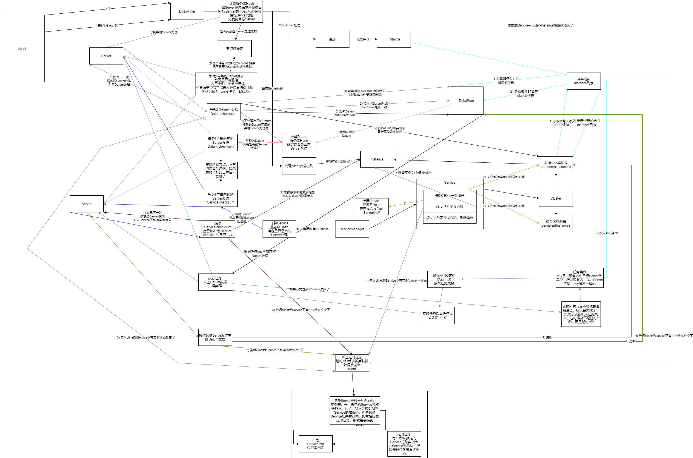

nacos 版本 1.4.1

# DistroProtocol

```java
@Component
public class DistroProtocol {
    private void startDistroTask() {
        if (EnvUtil.getStandaloneMode()) {
            isInitialized = true;
            return;
        }
        startVerifyTask();
        startLoadTask();
    }

    private void startVerifyTask() {
        GlobalExecutor.schedulePartitionDataTimedSync(new DistroVerifyTask(memberManager, distroComponentHolder),
                distroConfig.getVerifyIntervalMillis());
    }
}
```

## 定时任务

每5秒循环执行DistroVerifyTask

每5秒广播向其他Server发送 Datum checksum，其他 Server 如果发现你的 checksum 和我的不一样，就会请求源 Server 获取新数据，获取成功后更新本地 Datum 和本地实例表 

```java
public class DistroVerifyTask implements Runnable {
    
    private final ServerMemberManager serverMemberManager;
    
    private final DistroComponentHolder distroComponentHolder;
    
    public DistroVerifyTask(ServerMemberManager serverMemberManager, DistroComponentHolder distroComponentHolder) {
        this.serverMemberManager = serverMemberManager;
        this.distroComponentHolder = distroComponentHolder;
    }
    
    @Override
    public void run() {
        try {
            List<Member> targetServer = serverMemberManager.allMembersWithoutSelf();
            if (Loggers.DISTRO.isDebugEnabled()) {
                Loggers.DISTRO.debug("server list is: {}", targetServer);
            }
            for (String each : distroComponentHolder.getDataStorageTypes()) {
                verifyForDataStorage(each, targetServer);
            }
        } catch (Exception e) {
            Loggers.DISTRO.error("[DISTRO-FAILED] verify task failed.", e);
        }
    }
    
    private void verifyForDataStorage(String type, List<Member> targetServer) {
        DistroData distroData = distroComponentHolder.findDataStorage(type).getVerifyData();
        if (null == distroData) {
            return;
        }
        distroData.setType(DataOperation.VERIFY);
        //广播
        for (Member member : targetServer) {
            try {
                distroComponentHolder.findTransportAgent(type).syncVerifyData(distroData, member.getAddress());
            } catch (Exception e) {
                Loggers.DISTRO.error(String
                        .format("[DISTRO-FAILED] verify data for type %s to %s failed.", type, member.getAddress()), e);
            }
        }
    }
}

public class DistroDataStorageImpl implements DistroDataStorage {
    @Override
    public DistroData getVerifyData() {
        Map<String, String> keyChecksums = new HashMap<>(64);
        for (String key : dataStore.keys()) {
            //不处理不属于当前Server的Service
            if (!distroMapper.responsible(KeyBuilder.getServiceName(key))) {
                continue;
            }
            Datum datum = dataStore.get(key);
            if (datum == null) {
                continue;
            }
            //计算 Datum checksum
            keyChecksums.put(key, datum.value.getChecksum());
        }
        if (keyChecksums.isEmpty()) {
            return null;
        }
        DistroKey distroKey = new DistroKey("checksum", KeyBuilder.INSTANCE_LIST_KEY_PREFIX);
        return new DistroData(distroKey, ApplicationUtils.getBean(Serializer.class).serialize(keyChecksums));
    }
}

public class DistroHttpAgent implements DistroTransportAgent {
    @Override
    public boolean syncVerifyData(DistroData verifyData, String targetServer) {
        if (!memberManager.hasMember(targetServer)) {
            return true;
        }
        // put 请求 /v1/ns/distro/checksum
        NamingProxy.syncCheckSums(verifyData.getContent(), targetServer);
        return true;
    }
}
```

# DistroConsistencyServiceImpl

默认情况下，延时1秒后把数据广播同步到其他Server，如果发送给某了Server失败了,那么会重试，延时设置为5秒后

key = 代表Service key,在这1秒内，无论这个Service下实例发生了什么变化，也都会等到1秒后延时执行同步，并不是实例发生了改变就立即同步

```java
@DependsOn("ProtocolManager")
@org.springframework.stereotype.Service("distroConsistencyService")
public class DistroConsistencyServiceImpl implements EphemeralConsistencyService, DistroDataProcessor {
    @Override
    public void put(String key, Record value) throws NacosException {
        //将注册实例更新到内存注册表中
        onPut(key, value);
        //复制新数据到服务集群中
        distroProtocol.sync(new DistroKey(key, KeyBuilder.INSTANCE_LIST_KEY_PREFIX), DataOperation.CHANGE,
                globalConfig.getTaskDispatchPeriod() / 2);
    }
}
@Component
public class DistroProtocol {
    public void sync(DistroKey distroKey, DataOperation action, long delay) {
        //广播
        for (Member each : memberManager.allMembersWithoutSelf()) {
            DistroKey distroKeyWithTarget = new DistroKey(distroKey.getResourceKey(), distroKey.getResourceType(),
                    each.getAddress());
            //构造 DistroDelayTask
            DistroDelayTask distroDelayTask = new DistroDelayTask(distroKeyWithTarget, action, delay);
            //加入 distroTaskEngineHolder 中
            distroTaskEngineHolder.getDelayTaskExecuteEngine().addTask(distroKeyWithTarget, distroDelayTask);
            if (Loggers.DISTRO.isDebugEnabled()) {
                Loggers.DISTRO.debug("[DISTRO-SCHEDULE] {} to {}", distroKey, each.getAddress());
            }
        }
    }
}
public class NacosDelayTaskExecuteEngine extends AbstractNacosTaskExecuteEngine<AbstractDelayTask> {
    @Override
    public void addTask(Object key, AbstractDelayTask newTask) {
        lock.lock();
        try {
            AbstractDelayTask existTask = tasks.get(key);
            if (null != existTask) {
                //任务还在延时中
                newTask.merge(existTask);
            }
            //放入 tasks
            tasks.put(key, newTask);
        } finally {
            lock.unlock();
        }
    }

    protected void processTasks() {
        Collection<Object> keys = getAllTaskKeys();
        for (Object taskKey : keys) {
            AbstractDelayTask task = removeTask(taskKey);
            if (null == task) {
                continue;
            }
            NacosTaskProcessor processor = getProcessor(taskKey);
            if (null == processor) {
                getEngineLog().error("processor not found for task, so discarded. " + task);
                continue;
            }
            try {
                // ReAdd task if process failed
                if (!processor.process(task)) {
                    retryFailedTask(taskKey, task);
                }
            } catch (Throwable e) {
                getEngineLog().error("Nacos task execute error : " + e.toString(), e);
                retryFailedTask(taskKey, task);
            }
        }
    }

    @Override
    public AbstractDelayTask removeTask(Object key) {
        lock.lock();
        try {
            AbstractDelayTask task = tasks.get(key);
            //shouldProcess 会延迟指定时间间隔才能移除
            if (null != task && task.shouldProcess()) {
                return tasks.remove(key);
            } else {
                return null;
            }
        } finally {
            lock.unlock();
        }
    }
}

public class DistroDelayTask extends AbstractDelayTask {
    @Override
    public void merge(AbstractDelayTask task) {
        if (!(task instanceof DistroDelayTask)) {
            return;
        }
        DistroDelayTask newTask = (DistroDelayTask) task;
        if (!action.equals(newTask.getAction()) && createTime < newTask.getCreateTime()) {
            action = newTask.getAction();
            createTime = newTask.getCreateTime();
        }
        //修改 lastProcessTime
        setLastProcessTime(newTask.getLastProcessTime());
    }
}

public class DistroDelayTaskProcessor implements NacosTaskProcessor {
    @Override
    public boolean process(NacosTask task) {
        if (!(task instanceof DistroDelayTask)) {
            return true;
        }
        DistroDelayTask distroDelayTask = (DistroDelayTask) task;
        DistroKey distroKey = distroDelayTask.getDistroKey();
        if (DataOperation.CHANGE.equals(distroDelayTask.getAction())) {
            DistroSyncChangeTask syncChangeTask = new DistroSyncChangeTask(distroKey, distroComponentHolder);
            distroTaskEngineHolder.getExecuteWorkersManager().addTask(distroKey, syncChangeTask);
            return true;
        }
        return false;
    }
}

public class DistroSyncChangeTask extends AbstractDistroExecuteTask {
    @Override
    public void run() {
        Loggers.DISTRO.info("[DISTRO-START] {}", toString());
        try {
            String type = getDistroKey().getResourceType();
            //从 DataStore 获取数据
            DistroData distroData = distroComponentHolder.findDataStorage(type).getDistroData(getDistroKey());
            distroData.setType(DataOperation.CHANGE);
            boolean result = distroComponentHolder.findTransportAgent(type).syncData(distroData, getDistroKey().getTargetServer());
            if (!result) {
                //如果失败
                handleFailedTask();
            }
            Loggers.DISTRO.info("[DISTRO-END] {} result: {}", toString(), result);
        } catch (Exception e) {
            Loggers.DISTRO.warn("[DISTRO] Sync data change failed.", e);
            //如果失败
            handleFailedTask();
        }
    }

    private void handleFailedTask() {
        String type = getDistroKey().getResourceType();
        DistroFailedTaskHandler failedTaskHandler = distroComponentHolder.findFailedTaskHandler(type);
        if (null == failedTaskHandler) {
            Loggers.DISTRO.warn("[DISTRO] Can't find failed task for type {}, so discarded", type);
            return;
        }
        failedTaskHandler.retry(getDistroKey(), DataOperation.CHANGE);
    }
}
public class DistroHttpAgent implements DistroTransportAgent {
    @Override
    public boolean syncData(DistroData data, String targetServer) {
        if (!memberManager.hasMember(targetServer)) {
            return true;
        }
        byte[] dataContent = data.getContent();
        // put 请求 /v1/ns/distro/datum
        return NamingProxy.syncData(dataContent, data.getDistroKey().getTargetServer());
    }
}

public class DistroHttpCombinedKeyTaskFailedHandler implements DistroFailedTaskHandler {
    @Override
    public void retry(DistroKey distroKey, DataOperation action) {
        DistroHttpCombinedKey combinedKey = (DistroHttpCombinedKey) distroKey;
        for (String each : combinedKey.getActualResourceTypes()) {
            DistroKey newKey = new DistroKey(each, KeyBuilder.INSTANCE_LIST_KEY_PREFIX, distroKey.getTargetServer());
            //默认设置延时5秒后进行集群同步
            DistroDelayTask newTask = new DistroDelayTask(newKey, action, globalConfig.getSyncRetryDelay());
            distroTaskEngineHolder.getDelayTaskExecuteEngine().addTask(newKey, newTask);
        }
    }
}

```

# /v1/ns/distro/checksum

```java
@RestController
@RequestMapping(UtilsAndCommons.NACOS_NAMING_CONTEXT + "/distro")
public class DistroController {
@PutMapping("/checksum")
    public ResponseEntity syncChecksum(@RequestParam String source, @RequestBody Map<String, String> dataMap) {
        DistroHttpData distroHttpData = new DistroHttpData(createDistroKey(source), dataMap);
        distroProtocol.onVerify(distroHttpData);
        return ResponseEntity.ok("ok");
    }
}

@Component
public class DistroProtocol {
    public boolean onReceive(DistroData distroData) {
        String resourceType = distroData.getDistroKey().getResourceType();
        DistroDataProcessor dataProcessor = distroComponentHolder.findDataProcessor(resourceType);
        if (null == dataProcessor) {
            Loggers.DISTRO.warn("[DISTRO] Can't find data process for received data {}", resourceType);
            return false;
        }
        return dataProcessor.processData(distroData);
    }
}

@DependsOn("ProtocolManager")
@org.springframework.stereotype.Service("distroConsistencyService")
public class DistroConsistencyServiceImpl implements EphemeralConsistencyService, DistroDataProcessor {
    @Override
    public boolean processVerifyData(DistroData distroData) {
        DistroHttpData distroHttpData = (DistroHttpData) distroData;
        //源Server地址
        String sourceServer = distroData.getDistroKey().getResourceKey();
        //Datum checksum
        Map<String, String> verifyData = (Map<String, String>) distroHttpData.getDeserializedContent();
        onReceiveChecksums(verifyData, sourceServer);
        return true;
    }

    /**
     * Check sum when receive checksums request.
     *
     * @param checksumMap map of checksum
     * @param server      source server request checksum
     */
    public void onReceiveChecksums(Map<String, String> checksumMap, String server) {

        if (syncChecksumTasks.containsKey(server)) {
            // Already in process of this server:
            Loggers.DISTRO.warn("sync checksum task already in process with {}", server);
            return;
        }

        syncChecksumTasks.put(server, "1");

        try {

            List<String> toUpdateKeys = new ArrayList<>();
            List<String> toRemoveKeys = new ArrayList<>();
            for (Map.Entry<String, String> entry : checksumMap.entrySet()) {
                //不应该处理属于当前Server处理的key
                if (distroMapper.responsible(KeyBuilder.getServiceName(entry.getKey()))) {
                    // this key should not be sent from remote server:
                    Loggers.DISTRO.error("receive responsible key timestamp of " + entry.getKey() + " from " + server);
                    // abort the procedure:
                    return;
                }

                //本地 dataStore 不含这个key
                //本地 dataStore 对应 key 没有实例数据
                //本地 dataStore 对应 key 的实例数据发送变化
                if (!dataStore.contains(entry.getKey()) || dataStore.get(entry.getKey()).value == null || !dataStore
                        .get(entry.getKey()).value.getChecksum().equals(entry.getValue())) {
                    toUpdateKeys.add(entry.getKey());
                }
            }

            for (String key : dataStore.keys()) {

                if (!server.equals(distroMapper.mapSrv(KeyBuilder.getServiceName(key)))) {
                    continue;
                }

                //找到属于源 server 的 key
                //key 不在 checksumMap，说明源数据删除了
                if (!checksumMap.containsKey(key)) {
                    toRemoveKeys.add(key);
                }
            }

            Loggers.DISTRO
                    .info("to remove keys: {}, to update keys: {}, source: {}", toRemoveKeys, toUpdateKeys, server);

            for (String key : toRemoveKeys) {
                //当前Server也要跟着删除
                onRemove(key);
            }

            //没有数据更新
            if (toUpdateKeys.isEmpty()) {
                return;
            }

            try {
                DistroHttpCombinedKey distroKey = new DistroHttpCombinedKey(KeyBuilder.INSTANCE_LIST_KEY_PREFIX,
                        server);
                distroKey.getActualResourceTypes().addAll(toUpdateKeys);
                DistroData remoteData = distroProtocol.queryFromRemote(distroKey);
                if (null != remoteData) {
                    processData(remoteData.getContent());
                }
            } catch (Exception e) {
                Loggers.DISTRO.error("get data from " + server + " failed!", e);
            }
        } finally {
            // Remove this 'in process' flag:
            syncChecksumTasks.remove(server);
        }
    }
}

@Component
public class DistroProtocol {
    public DistroData queryFromRemote(DistroKey distroKey) {
        if (null == distroKey.getTargetServer()) {
            Loggers.DISTRO.warn("[DISTRO] Can't query data from empty server");
            return null;
        }
        String resourceType = distroKey.getResourceType();
        DistroTransportAgent transportAgent = distroComponentHolder.findTransportAgent(resourceType);
        if (null == transportAgent) {
            Loggers.DISTRO.warn("[DISTRO] Can't find transport agent for key {}", resourceType);
            return null;
        }
        return transportAgent.getData(distroKey, distroKey.getTargetServer());
    }
}

public class DistroHttpAgent implements DistroTransportAgent {
    @Override
    public DistroData getData(DistroKey key, String targetServer) {
        try {
            List<String> toUpdateKeys = null;
            if (key instanceof DistroHttpCombinedKey) {
                toUpdateKeys = ((DistroHttpCombinedKey) key).getActualResourceTypes();
            } else {
                toUpdateKeys = new ArrayList<>(1);
                toUpdateKeys.add(key.getResourceKey());
            }
            //get 请求 /v1/ns/distro/datum 获取数据
            byte[] queriedData = NamingProxy.getData(toUpdateKeys, key.getTargetServer());
            return new DistroData(key, queriedData);
        } catch (Exception e) {
            throw new DistroException(String.format("Get data from %s failed.", key.getTargetServer()), e);
        }
    }
}

@DependsOn("ProtocolManager")
@org.springframework.stereotype.Service("distroConsistencyService")
public class DistroConsistencyServiceImpl implements EphemeralConsistencyService, DistroDataProcessor {
    //data = 从源 Server 获取 Datum 数据
    private boolean processData(byte[] data) throws Exception {
        if (data.length > 0) {
            Map<String, Datum<Instances>> datumMap = serializer.deserializeMap(data, Instances.class);

            for (Map.Entry<String, Datum<Instances>> entry : datumMap.entrySet()) {
                //把新 Datum 数据 存入 dataStore
                dataStore.put(entry.getKey(), entry.getValue());

                //listeners 不包含 key
                if (!listeners.containsKey(entry.getKey())) {
                    // pretty sure the service not exist:
                    if (switchDomain.isDefaultInstanceEphemeral()) {
                        // create empty service
                        //创建空 service
                        Loggers.DISTRO.info("creating service {}", entry.getKey());
                        Service service = new Service();
                        String serviceName = KeyBuilder.getServiceName(entry.getKey());
                        String namespaceId = KeyBuilder.getNamespace(entry.getKey());
                        service.setName(serviceName);
                        service.setNamespaceId(namespaceId);
                        service.setGroupName(Constants.DEFAULT_GROUP);
                        // now validate the service. if failed, exception will be thrown
                        service.setLastModifiedMillis(System.currentTimeMillis());
                        service.recalculateChecksum();

                        // The Listener corresponding to the key value must not be empty
                        //与键值对应的监听器不能为空
                        RecordListener listener = listeners.get(KeyBuilder.SERVICE_META_KEY_PREFIX).peek();
                        if (Objects.isNull(listener)) {
                            return false;
                        }
                        //这里 listener 是 ServiceManager
                        listener.onChange(KeyBuilder.buildServiceMetaKey(namespaceId, serviceName), service);
                    }
                }
            }

            for (Map.Entry<String, Datum<Instances>> entry : datumMap.entrySet()) {

                //不应该存在
                if (!listeners.containsKey(entry.getKey())) {
                    // Should not happen:
                    Loggers.DISTRO.warn("listener of {} not found.", entry.getKey());
                    continue;
                }

                try {
                    for (RecordListener listener : listeners.get(entry.getKey())) {
                        //listener 就是 Service
                        listener.onChange(entry.getKey(), entry.getValue().value);
                    }
                } catch (Exception e) {
                    Loggers.DISTRO.error("[NACOS-DISTRO] error while execute listener of key: {}", entry.getKey(), e);
                    continue;
                }

                // Update data store if listener executed successfully:
                dataStore.put(entry.getKey(), entry.getValue());
            }
        }
        return true;
    }
}
```

# GET /v1/ns/distro/datum

```java
@RestController
@RequestMapping(UtilsAndCommons.NACOS_NAMING_CONTEXT + "/distro")
public class DistroController {
    @GetMapping("/datum")
    public ResponseEntity get(@RequestBody String body) throws Exception {
        
        JsonNode bodyNode = JacksonUtils.toObj(body);
        String keys = bodyNode.get("keys").asText();
        String keySplitter = ",";
        DistroHttpCombinedKey distroKey = new DistroHttpCombinedKey(KeyBuilder.INSTANCE_LIST_KEY_PREFIX, "");
        for (String key : keys.split(keySplitter)) {
            distroKey.getActualResourceTypes().add(key);
        }
        DistroData distroData = distroProtocol.onQuery(distroKey);
        return ResponseEntity.ok(distroData.getContent());
    }
}

@Component
public class DistroProtocol {
    public DistroData onQuery(DistroKey distroKey) {
        String resourceType = distroKey.getResourceType();
        DistroDataStorage distroDataStorage = distroComponentHolder.findDataStorage(resourceType);
        if (null == distroDataStorage) {
            Loggers.DISTRO.warn("[DISTRO] Can't find data storage for received key {}", resourceType);
            return new DistroData(distroKey, new byte[0]);
        }
        return distroDataStorage.getDistroData(distroKey);
    }
}

public class DistroDataStorageImpl implements DistroDataStorage {
    @Override
    public DistroData getDistroData(DistroKey distroKey) {
        Map<String, Datum> result = new HashMap<>(1);
        if (distroKey instanceof DistroHttpCombinedKey) {
            //批量获取 Datum
            result = dataStore.batchGet(((DistroHttpCombinedKey) distroKey).getActualResourceTypes());
        } else {
            Datum datum = dataStore.get(distroKey.getResourceKey());
            result.put(distroKey.getResourceKey(), datum);
        }
        byte[] dataContent = ApplicationUtils.getBean(Serializer.class).serialize(result);
        return new DistroData(distroKey, dataContent);
    }
}
```


# PUT /v1/ns/distro/datum

```java
@RestController
@RequestMapping(UtilsAndCommons.NACOS_NAMING_CONTEXT + "/distro")
public class DistroController {
@PutMapping("/datum")
    public ResponseEntity onSyncDatum(@RequestBody Map<String, Datum<Instances>> dataMap) throws Exception {

        if (dataMap.isEmpty()) {
            Loggers.DISTRO.error("[onSync] receive empty entity!");
            throw new NacosException(NacosException.INVALID_PARAM, "receive empty entity!");
        }

        for (Map.Entry<String, Datum<Instances>> entry : dataMap.entrySet()) {
            if (KeyBuilder.matchEphemeralInstanceListKey(entry.getKey())) {
                String namespaceId = KeyBuilder.getNamespace(entry.getKey());
                String serviceName = KeyBuilder.getServiceName(entry.getKey());
                if (!serviceManager.containService(namespaceId, serviceName) && switchDomain
                        .isDefaultInstanceEphemeral()) {
                    //如果没有，创建新 Service
                    serviceManager.createEmptyService(namespaceId, serviceName, true);
                }
                DistroHttpData distroHttpData = new DistroHttpData(createDistroKey(entry.getKey()), entry.getValue());
                distroProtocol.onReceive(distroHttpData);
            }
        }
        return ResponseEntity.ok("ok");
    }
}

@DependsOn("ProtocolManager")
@org.springframework.stereotype.Service("distroConsistencyService")
public class DistroConsistencyServiceImpl implements EphemeralConsistencyService, DistroDataProcessor {

    @Override
    public boolean processData(DistroData distroData) {
        DistroHttpData distroHttpData = (DistroHttpData) distroData;
        Datum<Instances> datum = (Datum<Instances>) distroHttpData.getDeserializedContent();
        onPut(datum.key, datum.value);
        return true;
    }
}
```


# 总结



client，可以去任意Server发心跳或者注册，因为到达Server会根据服务名计算hash，如果不是自己Server处理就会转发，最后只会是同一个Server处理

client,可以去任意Server订阅服务列表，因为 Server 和 Server 之间通过定时任务广播复制服务列表，服务列表最终一致性

client订阅的服务列表本地缓存每10秒刷新一次，这是拉模式，如果在10秒内有实例表更新了，Server 会推送新的数据过来，这是推模式

client 请求 Server 如果只填了一个 server-ip 会重试3次,如果填了多个，会重试所有你填的 server-ip

todo 有时间重新画一下上面那副大图

todo 持久化实例使用了cp模式，用了 sofajraft 实现的，暂时没有时间看

todo 配置中心

todo 和安全有关

todo istio


