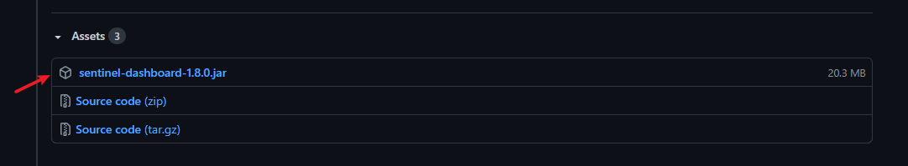
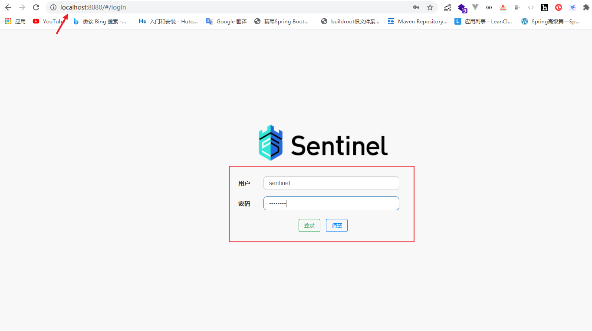
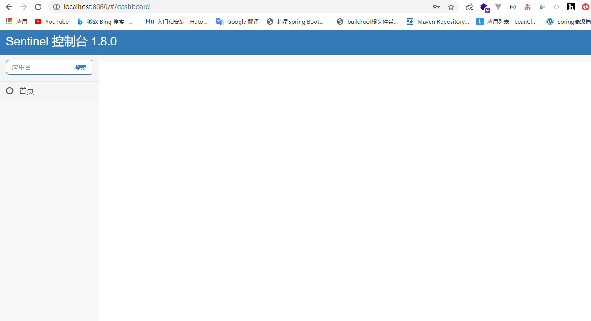

# 参考

[2020新版视频含SpringCloud Hoxton和SpringCloud alibaba](https://www.bilibili.com/video/BV18E411x7eT)

# 下载和运行

https://github.com/alibaba/Sentinel/releases



如果下载慢，可复制下面链接到迅雷等下载器下载

https://github.com.cnpmjs.org/alibaba/Sentinel/releases/download/v1.8.0/sentinel-dashboard-1.8.0.jar

执行下面命令

```powershell
java -jar sentinel-dashboard-1.8.0.jar
```

打开浏览器输入默认地址 http://localhost:8080/

账号和密码默认都是 sentinel



登陆后界面



因为 Sentinel 控制台是基于 Spring Boot 实现，所以我们可以通过启动时的命令行参数，自定义配置

--server.port：自定义服务器端口。默认为 8080 端口。

# 源码解析

## Sentinel 的数据统计

StatisticNode

统计节点保留三种实时统计指标：

- 秒级统计

- 分钟级统计

- 线程数

Sentinel使用滑动窗口实时记录和统计资源统计信息。

{@link ArrayMetric}后面的滑动窗口基础结构是{@code LeapArray}。


