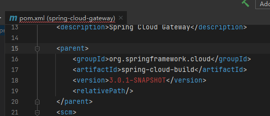
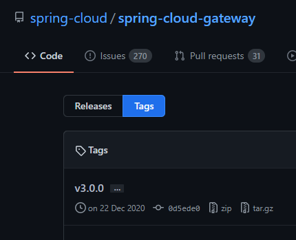
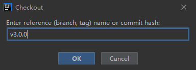
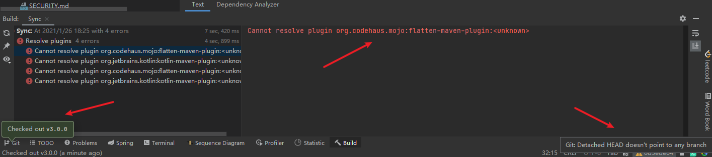
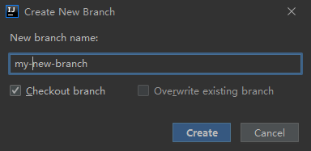
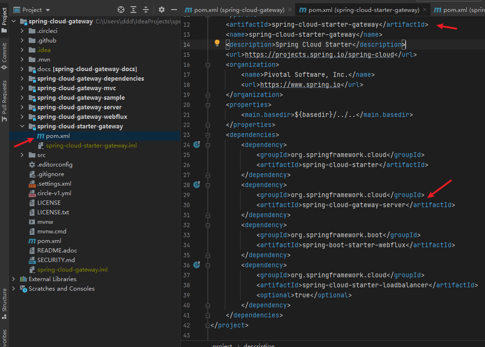
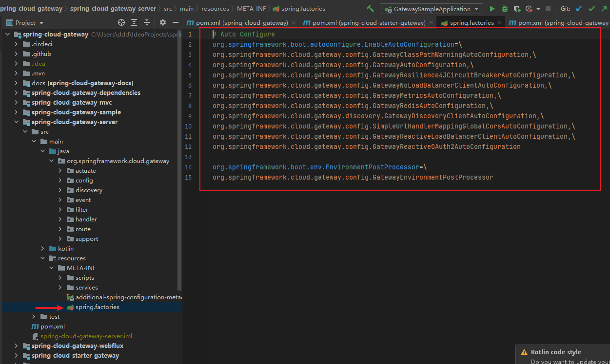

# 克隆代码

```shell
git clone https://github.com/spring-cloud/spring-cloud-gateway.git
```

用idea打开后发现master分支pom.xml文件parent找不到版本，在阿里云仓库找不到，不知道什么原因



看了下github当前tag版本是v3.0.0



在idea切换v3.0.0的tag



还是有错误，是插件没指定版本，这个暂时不管他了，因为切到了tag,没有指定分支，所以这时候要
new 一个自己的分支出来





项目要想使用gateway就需要加以下依赖

```xml
<dependencies>
        <dependency>
            <groupId>org.springframework.cloud</groupId>
            <artifactId>spring-cloud-starter-gateway</artifactId>
        </dependency>
</dependencies>
```

源码在如下的位置，它依赖了自身 spring-cloud-gateway-server 模块 



接下来重点看下 spring-cloud-gateway-server 模块

# spring-cloud-gateway-server

自动配置



能确定的是在初始化 GatewayAutoConfiguration 配置之前有以下4个配置,这4个配置也没法办确定顺序，按顺序看好了
，GatewayAutoConfiguration 配置之后的配置不属于这个项目

```text
org.springframework.cloud.gateway.config.GatewayClassPathWarningAutoConfiguration
org.springframework.cloud.gateway.config.GatewayRedisAutoConfiguration
org.springframework.cloud.gateway.discovery.GatewayDiscoveryClientAutoConfiguration
org.springframework.cloud.gateway.config.GatewayReactiveLoadBalancerClientAutoConfiguration
org.springframework.cloud.gateway.config.GatewayAutoConfiguration
```

剩下的没法确定顺序，按顺序看就好了

```text
org.springframework.cloud.gateway.config.GatewayResilience4JCircuitBreakerAutoConfiguration
org.springframework.cloud.gateway.config.GatewayNoLoadBalancerClientAutoConfiguration
org.springframework.cloud.gateway.config.GatewayMetricsAutoConfiguration
org.springframework.cloud.gateway.config.SimpleUrlHandlerMappingGlobalCorsAutoConfiguration
org.springframework.cloud.gateway.config.GatewayReactiveOAuth2AutoConfiguration
```

DiscoveryClientRouteDefinitionLocator
ReactiveLoadBalancerClientFilter
RedisRateLimiter


fromIterable

PredicateArgsEvent


